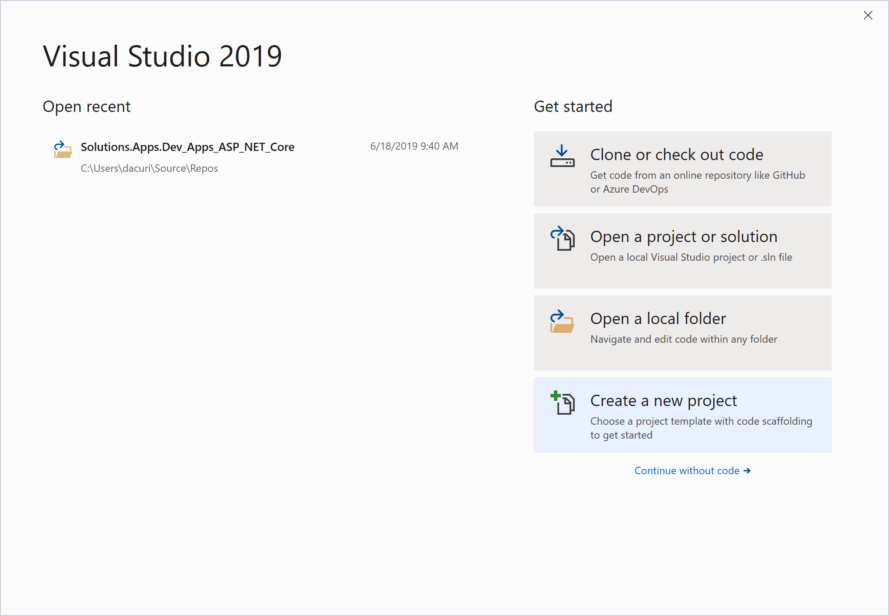
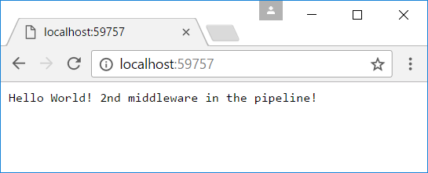
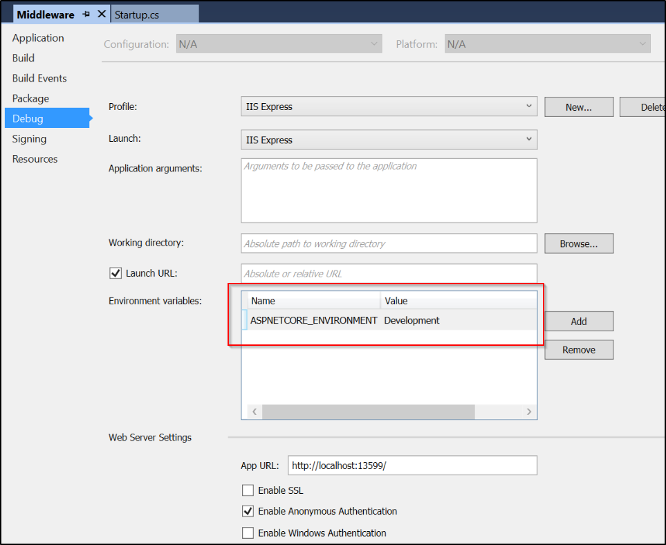

# Module 2: Overview

Student Lab Manual

Instructor Edition (Book Title Hidden Style)

**Conditions and Terms of Use**

**Microsoft Confidential**

This training package is proprietary and confidential, and is intended only for
uses described in the training materials. Content and software is provided to
you under a Non-Disclosure Agreement and cannot be distributed. Copying or
disclosing all or any portion of the content and/or software included in such
packages is strictly prohibited.

The contents of this package are for informational and training purposes only
and are provided "as is" without warranty of any kind, whether express or
implied, including but not limited to the implied warranties of merchantability,
fitness for a particular purpose, and non-infringement.

Training package content, including URLs and other Internet Web site references,
is subject to change without notice. Because Microsoft must respond to changing
market conditions, the content should not be interpreted to be a commitment on
the part of Microsoft, and Microsoft cannot guarantee the accuracy of any
information presented after the date of publication. Unless otherwise noted, the
companies, organizations, products, domain names, e-mail addresses, logos,
people, places, and events depicted herein are fictitious, and no association
with any real company, organization, product, domain name, e-mail address, logo,
person, place, or event is intended or should be inferred.

© 2020 Microsoft Corporation. All rights reserved.

**Copyright and Trademarks**

© 2020 Microsoft Corporation. All rights reserved.

Microsoft may have patents, patent applications, trademarks, copyrights, or
other intellectual property rights covering subject matter in this document.
Except as expressly provided in written license agreement from Microsoft, the
furnishing of this document does not give you any license to these patents,
trademarks, copyrights, or other intellectual property.

Complying with all applicable copyright laws is the responsibility of the user.
Without limiting the rights under copyright, no part of this document may be
reproduced, stored in or introduced into a retrieval system, or transmitted in
any form or by any means (electronic, mechanical, photocopying, recording, or
otherwise), or for any purpose, without the express written permission of
Microsoft Corporation.

For more information, see Use of Microsoft Copyrighted Content at  
<http://www.microsoft.com/about/legal/permissions/>

Internet Explorer, Microsoft, Visual Studio, and Windows are either registered
trademarks or trademarks of Microsoft Corporation in the United States and/or
other countries. Other Microsoft products mentioned herein may be either
registered trademarks or trademarks of Microsoft Corporation in the United
States and/or other countries. All other trademarks are property of their
respective owners.

Lab 1: Visual Studio and ASP.NET Core Overview
==============================================

#### Introduction

ASP.NET Core is a new open-source and cross-platform framework for building
modern cloud-based Web applications using Microsoft .NET Framework. We built it
from the ground up to provide an optimized development framework for apps that
are either deployed to the cloud or run on-premises. It consists of modular
components with minimal overhead, so you retain flexibility while constructing
your solutions. You can develop and run your ASP.NET Core applications
cross-platform on Windows, Mac and Linux. ASP.NET Core is fully open source on
GitHub.

The first preview of ASP.NET 1.0 was released almost 15 years ago. Since then
millions of developers have used it to build and run great web applications, and
over the years, we have added and evolved many capabilities to it.

With ASP.NET Core, we are making a number of architectural changes that make the
core web framework much leaner and more modular. ASP.NET Core is no longer based
on System.Web.dll, but is instead based on a set of granular and well factored
NuGet packages allowing you to optimize your app to have just what you need. You
can reduce the surface area of your application to improve security, reduce your
servicing burden, and also to improve performance in a true pay-for-what-you-use
model.

ASP.NET Core is built with the needs of modern Web applications in mind,
including a unified story for building Web UI and Web APIs that integrate with
today’s modern client-side frameworks and development workflows. ASP.NET Core is
also built to be cloud-ready by introducing environment-based configuration and
by providing built-in dependency injection support.

To appeal to a broader audience of developers, ASP.NET CORE supports
cross-platform development on Windows, Mac and Linux. The entire ASP.NET CORE
stack is open source and encourages community contributions and engagement.
ASP.NET CORE comes with a new, agile project system in Visual Studio while also
providing a complete command-line interface so that you can develop using the
tools of your choice.

In summary, with ASP.NET Core, you gain the following foundational improvements:

-   New light-weight and modular HTTP request pipeline

-   Ability to host on IIS or self-host in your own process

-   Built on .NET Core, which supports true side-by-side app versioning

-   Ships entirely as NuGet packages

-   Integrated support for creating and using NuGet packages

-   Single aligned web stack for Web UI and Web APIs

-   Cloud-ready environment-based configuration

-   Built-in support for dependency injection

-   New tooling that simplifies modern web development

-   Build and run cross-platform ASP.NET apps on Windows, Mac and Linux

-   Open source and community focused

**.NET Core**

.NET Core is a modular runtime and library implementation that includes a subset
of the .NET Framework. .NET Core consists of a set of libraries, called
“CoreFX”, and a small, optimized runtime, called “CoreCLR”. .NET Core is
open-source, so you can follow the progress on the project and contribute to it
on GitHub:

-   .NET Core Libraries (CoreFX)

-   .NET Core Common Language Runtime (CoreCLR)

The CoreCLR runtime (Microsoft.CoreCLR) and CoreFX libraries are distributed via
NuGet. The CoreFX libraries are factored as individual NuGet packages according
to functionality, named “System.[module]” on nuget.org.

One of the key benefits of .NET Core is its portability. You can package and
deploy the CoreCLR with your application, eliminating your application’s
dependency on an installed version of .NET (for example, .NET Framework on
Windows). You can host multiple applications side-by-side using different
versions of the CoreCLR, and upgrade them individually, rather than being forced
to upgrade all of them simultaneously.

CoreFX has been built as a componentized set of libraries, each requiring the
minimum set of library dependencies (for example, System.Collections only
depends on System.Runtime, not System.Xml). This approach enables minimal
distributions of CoreFX libraries (just the ones you need) within an
application, alongside CoreCLR. CoreFX includes collections, console access,
diagnostics, IO, Language Integrated Query (LINQ), JavaScript Object
Notification (JSON), XML, and regular expression support, just to name a few
libraries. Another benefit of CoreFX is that it allows developers to target a
single common set of libraries that are supported by multiple platforms.

When .NET Framework first shipped in 2002, it was a single framework, but it did
not take long before the .NET Compact Framework shipped, providing a smaller
version of .NET Framework designed for mobile devices. Over the years, this
exercise was repeated multiple times, so that today there are different flavors
of .NET Framework specific to different platforms. Add to this, the further
platform reach provided by Mono and Xamarin, which target Linux, Mac, and native
iOS and Android devices. For each platform, a separate vertical stack consisting
of runtime, framework, and app model is required to develop .NET applications.
One of the primary goals of .NET Core is to provide a single, modular,
cross-platform version of .NET that works the same across all of these
platforms. Since .NET Core is a fully open source project, the Mono community
can benefit from CoreFX libraries. .NET Core will not replace Mono, but it will
allow the Mono community to reference and share, rather than duplicate, certain
common libraries, and to contribute directly to CoreFX, if desired.

In addition to being able to target a variety of different device platforms,
there was also pressure from the server side to reduce the overall footprint,
and more importantly, surface area, of the .NET Framework. By factoring the
CoreFX libraries and allowing individual applications to pull in only those
parts of CoreFX, they require (a so-called “pay-for-play” model), server-based
applications built with ASP.NET Core to minimize their dependencies. This, in
turn, reduces the frequency with which patches and updates to the framework
impact these applications, since only changes made to the individual pieces of
CoreFX that is used by the application impact the application. A smaller
deployment size for the application is a side benefit, and one that makes more
of a difference if many applications are deployed side-by-side on a given
server.

#### Objectives

This lab will show you how to:

-   Create a new ASP.NET Core application in Visual Studio 2019.

-   Compile the application using .NET Core and .NET Framework.

-   Work with static files.

-   Create custom middleware.

-   Use working environments to configure application pipelines.

#### System Requirements

To complete this lab, you need:

-   Visual Studio 2019 or higher

-   .NET Core 3.1 (download from <https://dot.net>)

#### Estimated Time to Complete This Lab

60-100 minutes

Exercise 1: Create a New ASP.NET Core Application
-------------------------------------------------

#### Objectives

In this exercise, you will:

-   Create a new ASP.NET Core application in Visual Studio 2019.

-   Run the application using different web servers.

#### Task 1: Create the Visual Studio Solution

1.  Open Visual Studio 2019.

2.  Select **Create a new project**

    

3.  Choose **ASP.NET Core Web Application** (with the C\# language).

    

    > # Megjegyzés
    > VS22-ben a default *ASP.NET Core Web Application* opció Razor template-et ad, nem MVC template-et. A feladat az utóbbit kéri.

4.  Name the project *HelloWorld*, and change the location as per your own
    preferences. Leave the check box for **Place solution and project
    in the same directory**, unchecked. Click **Create**.

    

5.  Choose **Web Application (Model-View-Controller)** template and from drop downs
    select .NET Core / **ASP.NET Core 3.1**.  

    Make sure **Authentication** is set as "No Authentication" and to uncheck **Enable Docker Support**.

    > # Megjegyzés
    > A 3-as pontál már kiválasztottuk a template-et.
 
6.  Click **Create**.
    Visual Studio will take a few seconds to restore NuGet packages and setup a
    project.

7.  Build the application to ensure everything compiles well. (Build > Build Solution)

#### Task 2: Run the Application on Different Web Servers

1.  Run the application using **IIS Express**. Go to different application
    views.

    

2.  Take some time to review the following aspects of the project:

    -   Project file (\*.csproj)

    -   wwwroot folder

    -   Client-side dependencies

    -   Controllers, Models, ViewModels, and Views folders

    -   appsettings.json

    -   Startup.cs

    

3.  Now that you are a bit more familiar with ASP.NET Core project template and
    files involved, let us try to run the application using other web servers:
    using Kestrel and IIS Express.

4.  Choose **IIS Express** as the hosting server in Visual Studio and run the
    application.

    

5.  Visual Studio will deploy your app to IIS Express, which servers as a
    reverse proxy to Kestrel.

    

    
    ASP.NET Core is completely decoupled from the web server environment that hosts
    the application. ASP.NET Core supports hosting in IIS and IIS Express, and
    self-hosting scenarios using the Kestrel and WebListener HTTP servers.
    Additionally, developers and third party software vendors can create custom
    servers to host their ASP.NET Core apps.
    
    The default web host for ASP.NET apps developed using Visual Studio is IIS
    Express functioning as a reverse proxy server for Kestrel. The
    “Microsoft.AspNetCore.Server.Kestrel” and
    “Microsoft.AspNetCore.Server.IISIntegration” dependencies are included by
    default, even with the Empty Web Site template. Visual Studio provides support
    for multiple profiles, associated with IIS Express. You can manage these
    profiles and their settings in the Debug tab of your web application project’s
    Properties menu or from the launchSettings.json file.

6.  Open **Program.cs** to see how webhost is configured.

    ASP.NET Core apps require a host in which to execute. This is typically done
    in your app’s entry point: **public static void Main** (located in a
    Program.cs file). 

    

    > # Megjegyzés
    > .NET7-ben máshogy néz ki a `Program.cs` struktúrája.

    **What is the difference between a host and a server?**

    The host is responsible for application startup and lifetime management. The
    server is responsible for accepting HTTP requests. Part of the host’s
    responsibility includes ensuring the application’s services and the server are
    available and properly configured. You can think of the host as being a wrapper
    around the server. The host is configured to use a particular server; the server
    is unaware of its host.

    **Note:** If the app should work with IIS, the UseIISIntegration method should
    be called as part of building the host. Note that this does not configure a
    server, like UseKestrel does. To use IIS with ASP.NET Core, you must specify
    both UseKestrel and UseIISIntegration. Kestrel is designed to be run behind a
    proxy and should not be deployed directly facing the Internet. UseIISIntegration
    specifies IIS as the reverse proxy server.

    In ASP.NET Core 3.1, the UseIISIntegration extension method on Generic Host
    Builder is called automatically when you run with IIS.

    ASP.NET Core project templates use Kestrel by default. In Program.cs, the
    template code calls CreateDefaultBuilder, which
    calls [UseKestrel](https://docs.microsoft.com/aspnet/core/api/microsoft.aspnetcore.hosting.webhostbuilderkestrelextensions#Microsoft_AspNetCore_Hosting_WebHostBuilderKestrelExtensions_UseKestrel_Microsoft_AspNetCore_Hosting_IWebHostBuilder_)
    behind the scenes.

    UseKestrel and UseIISIntegration are very different actions. IIS is only used as
    a reverse proxy. UseKestrel creates the web server and hosts the code.
    UseIISIntegration specifies IIS as the reverse proxy server.


1.  After, run the application again using *HelloWorld* option.

    

    > **Note:** 
    > If you see this message, click "yes."
    >
    > 
    > 
    > Then click yes.  
    > 

    It should show the following window. The application is now self-hosted and will
    remain active if this process is not shut down.

    

    Now, instead of IIS Express – we are directly using Kestrel as web server to host the app.

    > # Megjegyzés
    > VS22-ben nem lehet közvetlenül futtatni a projektet, helyette a `https` launch profile-t kell kiválasztani, így láthatjuk a web szerver terminálját.

1.  Press **Ctrl + C** to shut down the server.

    We’ve now finished creating an ASP.NET Core Web Application!


Exercise 2: Middleware
----------------------

#### Introduction

Middleware are components that are assembled into an application pipeline to
handle requests and responses. Each component can choose whether to pass the
request on to the next component in the pipeline, and can perform certain
actions before and after the next component in the pipeline. Request delegates
are used to build this request pipeline, which are then used to handle each
incoming HTTP request to your application.

Request delegates are configured using Run, Map, and Use extension methods on
the IApplicationBuilder type that is passed into the Configure method in the
Startup class. An individual request delegate can be specified in-line as an
anonymous method, or it can be defined in a reusable class. These reusable
classes are middleware, or middleware components. Each middleware component in
the request pipeline is responsible for invoking the next component in the
chain, or can opt to short-circuit the chain if appropriate.

#### Objectives

In this exercise, you will:

-   Create a custom middleware

-   Use extension methods for built-in Static Files middleware

#### Task 1: Create a Custom Middleware

1.  Create a new **ASP.NET Core Web Application**, with the **Empty** template. And name the project *Middleware* - detailed steps are below:

    - Create a new project with the type of **ASP.NET Core Web Application** (like you've done in the previous exercises.)

    - Name the project *Middleware*, and then click **Create**.

    -  Choose **Empty** under ASP.NET Core templates. Leave other settings to
            default state. Click **Create**.

    -  Run the application to check that it works. It should show “**Hello World!”** text in the
            browser.


2.  Navigate to **Startup.cs** and replace **Configure( )** method with the following code:

```csharp
    public void Configure(IApplicationBuilder app, IWebHostEnvironment env)
    {
        app.Run(async (context) =>
        {
            await context.Response.WriteAsync("Hello World! ");
        });

        app.Run(async (context) =>
        {
            await context.Response.WriteAsync("2nd middleware in the pipeline!");
        });
    }
```

> # Megjegyzés
> .NET7 projektekben már nincs `Startup.cs`, minden beállítás a `Program.cs`-ben van:
> ```csharp
> //Program.cs
> var builder = WebApplication.CreateBuilder(args);
> var app = builder.Build();
> 
> app.Run(async (context) =>
> {
>    await context.Response.WriteAsync("Hello World from 1st middleware");
> });
>
> app.Run(async (context) =>
> {
>    await context.Response.WriteAsync("2nd middleware in the pipeline!");
> });
>
> app.Run();
> ```

3. When you run the application, it still only shows a single Hello World statement. **Why is the 2nd middleware not executed?**

    It is important to realize that the request delegate as written in the first middleware, uses **app.Run()** and will terminate the pipeline, regardless of other calls to app.Run() that you may include. Therefore, only the first delegate (“Hello, World!”) will be run and displayed.

    You must chain multiple request delegates together making a different call to app.Use(), with a **next** parameter representing the next delegate in the pipeline. Note that just because you are calling “**next**” does not mean you cannot perform actions both before and after the next delegate. 

4. Let us replace the **Configure()** method code with the following:

```csharp
    public void Configure(IApplicationBuilder app, IWebHostEnvironment env)
    {
        app.Use(async (context, next) =>
        {
            await context.Response.WriteAsync("Hello World! ");
            await next.Invoke();
        });

        app.Run(async (context) =>
        {
            await context.Response.WriteAsync("2nd middleware in the pipeline!");
        });
    }
```

> # Megjegyzés
> Itt is még mindig a `Program.cs`-ben vagyunk.

**Note:** You configure the HTTP pipeline using the extensions **Run, Map**, and
**Use**. By convention, the Run method is simply a shorthand way of adding
middleware to the pipeline that does not call any other middleware (that is, it
will not call a next request delegate). Thus, Run should only be called at the
end of your pipeline. Run is a convention, and some middleware components may
expose their own Run[Middleware] methods that should only run at the end of the
pipeline.

In the above code, the first middleware uses **Use** and the terminating
middleware uses **Run**.

5.  Run the application now. It should show both text lines in the browser.

    

    We’ve just finished writing some in-line middleware!

#### Task 2: Use Built-in Middleware

You have created in-line middleware so far. Let us use the **Static File** built-in middleware in ASP.NET Core.

1. Go to **Startup.cs**, and add the following line at the start of the **Configure()** method:
```csharp
    app.UseWelcomePage();
```
2.  Running the application now should show a Welcome page, like below.

    

    **Important:** The order in which you arrange your **Use[Middleware]**
    statements in your application’s Configure method is very important. Be sure you
    have a good understanding of how your application’s request pipeline will behave
    in various scenarios.

We’ve just successfully used a built-in middleware component!

#### Task 3: Use Static Files Middleware
Now let’s look at using statics files:

1.  Add the **wwwroot** folder. (Right-click on the project file **Middleware > Add > New Folder**).

2.  Under **wwwroot** - create the two subfolders **css** and **Images**.

3. Within the **wwwroot** subfolders (css, Images) - add the assets from the Asset folder.

    - Right-click **css > Add > Existing Item**
    - Right-click **Images > Add > Existing Item**

    When you’re done, the folder structure should look like the following:

    

4. Comment out the Welcome Page middleware statement below:

```csharp
    //app.UseWelcomePage();
```
5. Add the following line to the start of the **Configure()** method:

```csharp
    app.UseStaticFiles();
```

6.  Run the application and go to:

    [http://localhost:[YOUR LOCALHOST PORT]/images/surfacebook.jpg](http://localhost:XXXX/images/surfacebook.jpg)  

    It will show an **image** of Surface Book.

    

7.  Similarly, going to the following URL will let you download the CSS file: 

    [http://localhost:[YOUR LOCALHOST PORT]/css/site.css](http://localhost:%5BYOUR%20LOCALHOST%20PORT%5D/css/site.css)
    
    Using the **app.UseStaticFiles()** middleware has enabled access to all of the static files in the wwwroot folder.

8.  Now let’s restrict access to parts of the static folder. Comment out the existing **UseStaticFiles()** middleware component and replace with the following middleware:

```csharp
    //app.UseStaticFiles();

    app.UseStaticFiles(new StaticFileOptions
    {
        FileProvider = new PhysicalFileProvider($@"{env.WebRootPath}\Images"),
        RequestPath = new PathString("/img")
    });
```

> # Megjegyzés
> `env.WebRootPath` helyett `app.Environment.WebRootPath`

And add the following using statements for the above code:

```csharp
    using Microsoft.Extensions.FileProviders;
```
9.  Build and start your web app. 

    It will now let you access the image using [http://localhost:[YOUR LOCALHOST PORT]/img/surfacebook.jpg](http://localhost:XXXX/img/surfacebook.jpg). However, it will not let you directly download other static files in **wwwroot** folder.

    **Note**: If you can still access those files, try opening the Edge browser in
    private/incognito mode via *Ctrl + Shift + P*. It might be cached in the
    browser.

We’ve successfully enabled use of our static files in the wwwroot folder, and then restricted access to parts of it!

Exercise 3: Working Environments
--------------------------------

#### Introduction

ASP.NET Core introduces improved support for controlling application behavior
across multiple environments, such as development, staging, and production.
Environment variables are used to indicate which environment the application is
running in, allowing the app to be configured appropriately.

ASP.NET Core references a particular environment variable to describe the
environment, the application is currently running in. This variable can be set
to any value you like, but three values are used by convention: *Development*,
*Staging*, and *Production*. You will find these values used in the samples and
templates provided with ASP.NET Core.

#### Objectives

In this exercise, you will:

-   Configure different pipelines for development and production working
    environments.

#### Task 1: Create a New Application Pipeline for Development Environment

1. Let’s continue with our *Middleware* project.  

    Create a **ConfigureDevelopment()** method in the **Startup** class in **Startup.cs**. Place this above the existing **Configure()** method. It should look something like the code below:

```csharp
    public void ConfigureDevelopment(IApplicationBuilder app)
    {
    }

    public void Configure(IApplicationBuilder app, IWebHostEnvironment env)
    {
        // Existing method:   
        // Middleware code excluded for brevity
    }
```


**Note:** In addition to using an entirely separate Startup class based on the
current environment, you can also adjust how the application is configured
within a **Startup** class.

The **Configure()** and **ConfigureServices()** methods support
environment-specific versions similar to the Startup class itself, of the form
**Configure** and **Configure[Environment]Services()**.

If you define a method **ConfigureDevelopment()** it will be called instead of
**Configure()** when the **environment** is set to **development**. Likewise,
**ConfigureDevelopmentServices()** would be called instead of
**ConfigureServices()** in the same environment.

1.  It makes sense to give unrestricted access to static files in the **Development** and environments. And we'll want to use the Welcome page in this environment as well.
    
    Add the following two statements to the **ConfigureDevelopment( )** method:

```csharp
    app.UseStaticFiles();
    app.UseWelcomePage();
```


3.  Remove the welcome-page and static files middleware from the regular
    **Configure( )** method.

4.  Modify first middleware’s text to “*Hello World, from Production! \<br/\>*”.

5.  After all of the above actions, **Startup.cs** class should look like below:

```csharp
    public class Startup
    {
        public void ConfigureServices(IServiceCollection services)
        {
        }

        public void ConfigureDevelopment(IApplicationBuilder app)
        {
            app.UseStaticFiles();
            app.UseWelcomePage();
        }

        public void Configure(IApplicationBuilder app, IWebHostEnvironment env)
        {      
            app.Use(async (context, next) =>
            {
                await context.Response.WriteAsync("Hello World, from Production! <br/>");
                await next.Invoke();
            });

            app.Run(async (context) =>
            {
                await context.Response.WriteAsync("2nd middleware in the pipeline!");
            });
        }
    }
```

> # Megjegyzés
> ```csharp
> //Program.cs
> var builder = WebApplication.CreateBuilder(args);
> var app = builder.Build();
>
> if (app.Environment.IsDevelopment())
> {
>    app.UseStaticFiles();
>    app.UseWelcomePage();
> }
>
> else if (app.Environment.IsProduction())
> {
>    app.Use(async (context, next) =>
>    {
>        await context.Response.WriteAsync("Hello World from production! ");
>        await next.Invoke();
>    });
>
>    app.Run(async (context) =>
>    {
>        await context.Response.WriteAsync("2nd middleware in the pipeline!");
>    });
>}
>
> else
> {
>    app.Run(async (context) =>
>    {
>        await context.Response.WriteAsync("Select Development or Production environment!");
>    });
> }
>
> app.Run();
> ```

6.  Go to project properties (right-click **Middleware > Properties**). Then go to the **Debug** tab. See that the ASPNETCORE_ENVIRONMENT variable value is set to **Development**.

    

> # Megjegyzés
> Az environment-et a **<projektnév> Debug Properties** alatt lehet módosítani. Mindegyik **Launch Profile**-nál meg lehet adni environment variable-t.

7.  Run the application. Navigate to any static file URL. As you can see, you
    have unrestricted access to all static contents.
    
    Navigating to any other URL (such as [http://localhost:[YOUR LOCALHOST PORT]/help](http://localhost:[YOUR%20LOCALHOST%20PORT]/help)) in the application will show the **welcome** page.

    

8.  Go back to project properties in Visual Studio. Set *ASPNETCORE_ENVIRONMENT* variable to **Production**.

9.  Run the application again. Since there is no dedicated **ConfigureProduction( )** method, it will run **Configure( )** method to configure to application pipeline.

    

We’ve just configured different pipelines for two different environments - the
*development* and *production* environments!
