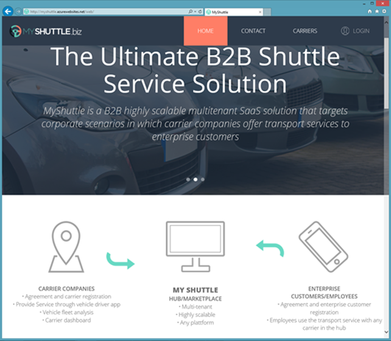

# Module 03: Models and EF Core

Student Lab Manual

Instructor Edition (Book Title Hidden Style)

**Conditions and Terms of Use**

Microsoft Confidential

This training package is proprietary and confidential, and is intended only for
uses described in the training materials. Content and software is provided to
you under a Non-Disclosure Agreement and cannot be distributed. Copying or
disclosing all or any portion of the content and/or software included in such
packages is strictly prohibited.

The contents of this package are for informational and training purposes only
and are provided "as is" without warranty of any kind, whether express or
implied, including but not limited to the implied warranties of merchantability,
fitness for a particular purpose, and non-infringement.

Training package content, including URLs and other Internet Web site references,
is subject to change without notice. Because Microsoft must respond to changing
market conditions, the content should not be interpreted to be a commitment on
the part of Microsoft, and Microsoft cannot guarantee the accuracy of any
information presented after the date of publication. Unless otherwise noted, the
companies, organizations, products, domain names, e-mail addresses, logos,
people, places, and events depicted herein are fictitious, and no association
with any real company, organization, product, domain name, e-mail address, logo,
person, place, or event is intended or should be inferred.

© 2020 Microsoft Corporation. All rights reserved.

**Copyright and Trademarks**

© 2020 Microsoft Corporation. All rights reserved.

Microsoft may have patents, patent applications, trademarks, copyrights, or
other intellectual property rights covering subject matter in this document.
Except as expressly provided in written license agreement from Microsoft, the
furnishing of this document does not give you any license to these patents,
trademarks, copyrights, or other intellectual property.

Complying with all applicable copyright laws is the responsibility of the user.
Without limiting the rights under copyright, no part of this document may be
reproduced, stored in or introduced into a retrieval system, or transmitted in
any form or by any means (electronic, mechanical, photocopying, recording, or
otherwise), or for any purpose, without the express written permission of
Microsoft Corporation.

For more information, see Use of Microsoft Copyrighted Content at  
<http://www.microsoft.com/en-us/legal/intellectualproperty/Permissions/default.aspx>

Azure, Microsoft, SQL Server, and Visual Studio are either registered trademarks
or trademarks of Microsoft Corporation in the United States and/or other
countries. Other Microsoft products mentioned herein may be either registered
trademarks or trademarks of Microsoft Corporation in the United States and/or
other countries. All other trademarks are property of their respective owners.

Lab 2: Creating Model
=====================

#### Introduction

MyShuttle is a B2B highly scalable multi-tenant software as a service (SaaS)
solution that targets corporate scenarios in which carrier companies offer
transport services to enterprise customers.


This multi-tenant SaaS system would allow any number of carrier companies who
must be syndicated with the system, to provide their services (cabs/shuttles)
directly to any number of customer-enterprises/companies who would also be
registered in the MyShuttle.biz system. The final outcome is that any employee
in those customer companies would be able to request a cab/shuttle at any time
in any place/city without worrying about how to pay. Everything would take place
between their company and the carrier company for that ride.

The global scenario is described in the following image:


There are two web applications in the above scenario:

**Public Website:**

It is a typical public website. Its main purpose is to show information about
the business but in a modern and clean way. It provides a responsive design and
even if you resize the browser, you can see how it would also be perfectly valid
for mobile devices, like a smartphone.




**Private Web Application:**

The second application is a Web Single Page Application (SPA), which you can
access by logging in from the public website. However, in reality it is like a
different web application, simulating a private web application especially made
for the Carriers’ administrators.

This application is a data-driven and CRUD app so you can create and update
information about your drivers, vehicles, etc. This application consumes the
ASP.NET Core Web API Services using client-side frameworks.


In this series of labs, you will build the public website and some parts of the
private web application above.

#### Objectives

This lab will show you how to:

-   Create a new ASP.NET Core application in Microsoft Visual Studio 2019.

-   Create Visual Studio projects for application model.

-   Create application model using code-first technique.

#### System Requirements

To complete this lab, you need:

-   Microsoft Visual Studio 2019 or higher

#### Estimated Time to Complete This Lab

40-70 minutes

#### For more information, (if applicable)

Refer the following blog post to see how MyShuttle application interoperates
with a number of other client-side applications:

<http://blogs.msdn.com/b/cesardelatorre/archive/2014/11/30/myshuttle-biz-demo-apps-from-connect-visual-studio-and-azure-event.aspx>

Exercise 1: Create MyShuttle Model
----------------------------------

#### Objectives

In this exercise, you will:

-   Create a new Visual Studio solution for MyShuttle application.

-   Create a project to implement MyShuttle model through code-first technique.

#### Task 1: Create the Visual Studio Solution

1.  Open Visual Studio 2019.

2.  Create a new ASP.NET Core application project clicking on **Create New
    Project**.

3.  Choose the **ASP.NET Core Web Application** template, leaving the checkbox
    **Place solution and project in the same directory** unselected.

4.  Name the project **MyShuttle**.

5.  Choose **Empty** project template.

     

6.  Rename the default project as **MyShuttle.Web.**

    

7. Since you chose .NET Core, the application only targets .NET Core out of the box. Your solution explorer should like this:

    
    


You’ve created your application, and now you are ready to start creating your
models!

#### Task 2: Create the Model Project

1.  Right-click **MyShuttle** solution in the **Solution Explorer** window and
    then click **Add New Project**.

2.  Choose **Class Library (.NET Standard)** project template and name it
    **MyShuttle.Model**, and then click **Create**.

    

3.  Delete **Class1.cs**.

**Note:** It is recommended to use the Class Library (.NET Standard) over the Class
Library (.NET Core), unless you need to use features that are only available in
.NET Core. This lets you reuse your library across different types of
applications. Update the Target framework version to 2.1 by viewing the properties of MyShuttle.Model.

   


#### Task 3: Implement the Model Project

We need to implement a carrier model class to represent the carrier.

1.  Right-click the **MyShuttle.Model** project and click **Add New Item**.

2.  Choose **Class** from available templates and name it **Carrier.cs**.

    

3.  Remove all the “using” statements above the namespace block, apart from
    **System.Collections.Generic** which will be used shortly.

4.  Make sure the Carrier class is marked as **public**.

```csharp
    public class Carrier
    {
    }
```

5.  We will need carrier information in the database, such as its name,
    description, address, email, logo, etc. We need to create our first model class.

    So add the following fields to **Carrier** model class, to store carrier
    information. This will be the basis for the carrier information in the database. You will add foreign key collections later.

```csharp
        public class Carrier
        {
            public int CarrierId { get; set; }

            public string Name { get; set; }

            public string Description { get; set; }

            public string CompanyID { get; set; }

            public string Address { get; set; }

            public string ZipCode { get; set; }

            public string City { get; set; }

            public string State { get; set; }

            public string Country { get; set; }

            public string Phone { get; set; }

            public string Email { get; set; }

            public byte[] Picture { get; set; }

            public double RatingAvg { get; set; }
        }
```

6. But you also need to create models for the enterprise company, company’s
    employees, carrier’s vehicles and drivers, and rides that enterprise
    company’s employees take. Additionally, you will also add model for
    performing analytics.
    
    Instead of writing code for each model entity, add the following files from
    the respective `…/Assets/MyShuttle.Model` folder by **Add Existing Item**.
    
    
    
    **ApplicationUser.cs** - User of the application, connected to carrier  
    **Customer.cs** - Customer enterprise company  
    **Driver.cs** - Registered driver of the shuttle company who drives the vehicle  
    **Employee.cs** - Employee of the enterprise company who rides/rents a vehicle  
    **Ride.cs** - Record of trip taken by an employee of a company in a vehicle driven by
    a driver  
    **Vehicle.cs** - Vehicle driven by a Driver  
    **VehicleStatus.cs** - Current status of a vehicle, whether it’s available, busy, or
    unknown  
    **VehicleType.cs** - Type of vehicle, such as compact, van, luxury, etc  

7. When you're done, you'll have nine files underneath the **MyShuttle.Model** project. Your file structure should look like this:

    

8. Add a new folder named **Analytics** under the **MyShuttle.Model** project. 

    Now that you have all the model entities defined, you will want to
    perform some analytics on the database records. To hold analytical data, we
    need to define model for it.
    

9.  Now add files to the newly created folder. Right-click the **Analytics** folder and click **Add Existing Item**. Add the two files from the `…/Assets/MyShuttle.Model/Analytics` folder.

    

10. Your file structure should look like this:

    

11. Next, add the **Identity** dependency for the project.
    - Right-click the **MyShuttle.Model** project in Solution Explorer.
    - Choose **Manage NuGet Packages**. 
    - Search for **Microsoft.AspNetCore.Identity.EntityFrameworkCore** (version 3.1.3). 
    - Click **Install** and accept the license agreement dialog box.

    Before ASP.NET Core, you would have added either a direct assembly reference
    or a NuGet package. Beginning with ASP.NET Core, direct assembly reference
    is not possible. We will need to add a NuGet package instead. Use the NuGet
    Package Manager to install the dependency.

    
    

12. Each carrier (represented by the Carrier.cs class) has vehicles and drivers associated with it. You did not add any collection references before because model classes for vehicles and drivers did not exist then. Now that they have been added to the project, we'll make references to them in the Carrier.cs class.

    Add the following collections at the bottom of **Carrier**
    class.

```csharp
        public class Carrier
        {
            // Code excluded for brevity
            . . .

            public ICollection <Vehicle> Vehicles { get; set; }
            public ICollection <Driver> Drivers { get; set; }

        }
```

    This will require to add the following using statement to the top of the **Carrier.cs** file.

```csharp
    using System.Collections.Generic;
```

13. Take the time to go through all the model classes and understand the attributes they have and how they are connected to each other.

    The Core CLR is a lean and completely modular runtime for ASP.NET Core
    projects. This CLR has been re-designed into components so you have the
    flexibility to include only those features that you need in your app. You
    add the components as NuGet packages. When you are finished, your app is
    dependent only on required features. 
    
    By re-factoring the runtime into separate components, Microsoft can help
    deliver improvements to the components more quickly because each component
    is updated on its own schedule. The Core CLR is about 11 megabytes instead
    of around 200 megabytes for the full .NET CLR. The Core CLR can be deployed
    with your app and different versions of the Core CLR can run side-by-side.
    Hence, if possible, it is better to target Core CLR instead of full .NET CLR
    because of all the good reasons mentioned above.


14. Build the application to ensure that it compiles successfully.

You have now completed defining the model! Now you are ready to implement data repository pattern to perform database CRUD operations.

Exercise 2: Implement MyShuttle Data CRUD Logic
-----------------------------------------------

#### Objectives

In this exercise, you will:

-   Create a project to implement repository pattern for database CRUD
    operations.

-   Create dummy data for this app.

#### Task 1: Create the Data Project

1.  If not already open, open **MyShuttle** solution in **Visual Studio
    2019**.

2.  Right-click **MyShuttle** solution in the Solution Explorer. Then click **Add \> New Project**.

3.  Choose **Class Library (.NET Standard)** project template and name it **MyShuttle.Data**.
    
    

4.  Delete **Class1.cs**.
5.  Update the **Target framework** by right clicking MyShuttle.Data and selecting **Properties**. Then change the **.Net Standard** version to 2.1.

Now we’re ready to implement the logic to initialize data.

#### Task 2: Implement the Data Initialization Logic

1.  You need to define dependencies for this project. Add the following dependencies (via the NuGet Package Manager) to the **MyShuttle.Data** project:

    -   **Microsoft.AspNetCore.Identity.EntityFrameworkCore** (version 3.1.3)

    -   **Microsoft.Extensions.Configuration.Json** (version 3.1.3)

    -   **Microsoft.EntityFrameworkCore.SqlServer** (version 3.1.3)

    Your dependencies node will look like this:

    

2.  Add a reference to **MyShuttle.Model** to this project:

    - Right-click **MyShuttle.Data** \> **Add** \> **Reference**.  
    - Go to the **Projects** tab, and check the box for **MyShuttle.Model**.

    

    You’ll now see a reference to it under the Dependencies/Projects node. The dependencies will be neatly organized in categories underneath the Dependencies node.

    

3. Now let’s add the logic for our data class.
    - Right-click the **MyShuttle.Data** project
    - Click **Add Existing Item**.
    - Add the **MyShuttleContext.cs** file to the project root from `…/Assets/MyShuttle.Data` folder.

    This class implements the database context of Entity Framework (EF) which
    declares all entities and their relationships using Code First approach.

4. Add a new folder to **MyShuttle.Data** and name it **Infrastructure**. 

5. Add the following two existing items under the **Infrastructure** folder from the `…/Assets/MyShuttle.Data/Infrastructure` folder:

    - **FakeImages.cs:** It contains images for drivers, vehicles, etc. 
    - **MyShuttleDataInitializer.cs:** It contains dummy data and initialization
    logic.

    Your solution explorer should look like this when you're done:

    


We’ve finished implementing our data initialization part! We’ve created dummy
data to fill out the database initially. Let’s move on to implementing our data repositories.

#### Task 3: Implement Data Repositories

1. Add a new folder to **MyShuttle.Data** and name it **Interfaces**. This folder will contain all repository interfaces.

2. Right-click the **Interfaces** folder and click **Add** \> **New Item** to
    add a new class. Name it **ICarrierRepository.cs**

3. Define the interface as following:

    **Important!** See that the default namespace would be *MyShuttle.Data.Interfaces*, but we have renamed this to be *MyShuttle.Data* for simplicity.

    Also note that we’ve replaced the key word “class” with “interface”. And we’ve made it ”public” so we can access it from our other projects.

```csharp
    using System.Collections.Generic;
    using System.Threading.Tasks;
    using MyShuttle.Model;

    namespace MyShuttle.Data
    {
        public interface ICarrierRepository
        {
            Task<int> AddAsync(Carrier carrier);
            Task<SummaryAnalyticInfo> GetAnalyticSummaryInfoAsync(int carrierId);
            Task<Carrier> GetAsync(int carrierId);
            Task<List<Carrier>> GetCarriersAsync(string filter);
            Task UpdateAsync(Carrier carrier);
        }
    }
```

    - **AddAsync**: Adds a new carrier to the database.
    - **GetAnalyticSummaryInfoAsync**: Performs some analytics and returns summary analytics like rating, total drivers, passengers, and vehicles of a carrier.
    - **GetAsync**: Returns a carrier record matching the input Carrier ID.
    - **GetCarriersAsync**: Used by the search function to return all carriers that match the input criteria.
    - **UpdateAsync**: Updates carrier record in the database.

4. We’ve created our first repository interface. Now let’s add the interfaces
    for the other repositories. Add the following existing items from the
    `…/Assets/MyShuttle.Data/Interfaces/` folder.

    -   ICustomerRepository.cs
    -   IDriverRepository.cs
    -   IEmployeeRepository.cs
    -   IRidesRepository.cs
    -   IVehicleRepository.cs

         

5. After defining all the interfaces, it is time to implement them. You will implement CarrierRepository on your own. The rest of them will be added from the assets folder.

    Add a new folder to **MyShuttle.Data** and name it **Repositories**. This folder will all repository classes.

6. Add a new class to the **Repositories** folder. Name it **CarrierRepository.cs**.

7.  Implement **CarrierRepository.cs** with the following code. The **CarrierRepository** should implement the **ICarrierRepository** interface. 
   

    **Important!** Note that the default namespace would be *MyShuttle.Data.Repositories*, but we have renamed this to be *MyShuttle.Data* for simplicity.

```csharp
    using System;
    using System.Collections.Generic;
    using System.Linq;
    using System.Threading.Tasks;
    using MyShuttle.Model;
    using Microsoft.EntityFrameworkCore;

    namespace MyShuttle.Data
    {
        public class CarrierRepository : ICarrierRepository
        {
            MyShuttleContext _context;
            static readonly int DEFAULT_PICTURE = 0;

            public CarrierRepository(MyShuttleContext dbcontext)
            {
                _context = dbcontext;
            }

            public async Task<int> AddAsync(Carrier carrier)
            {
                carrier.Picture = Convert.FromBase64String(FakeImages.Carriers[DEFAULT_PICTURE]);
                _context.Carriers.Add(carrier);
                await _context.SaveChangesAsync();
                return carrier.CarrierId;
            }

            public async Task<SummaryAnalyticInfo> GetAnalyticSummaryInfoAsync(int carrierId)
            {
                var passengers = await _context.Rides.Where(r => r.CarrierId == carrierId).Select(r => r.EmployeeId).ToListAsync();
                var rating = _context.Rides.Where(r => r.CarrierId == carrierId).Select(r => r.Rating);

                return new SummaryAnalyticInfo()
                    {
                        Rating = (rating.Count() > 0) ? rating.Average() : 0,
                        TotalDrivers = await _context.Drivers.Where(r => r.CarrierId == carrierId).CountAsync(),
                        TotalPassengers = passengers.Distinct().Count(),
                        TotalVehicles = await _context.Vehicles.Where(r => r.CarrierId == carrierId).CountAsync()
                    };
            }

            public async Task<Carrier> GetAsync(int carrierId)
            {
                return await _context.Carriers
                    .Where(c => c.CarrierId == carrierId)
                    .SingleOrDefaultAsync();
            }

            public async Task<List<Carrier>> GetCarriersAsync(string filter)
            {
                var carriers = _context.Carriers.AsQueryable();

                if (!String.IsNullOrEmpty(filter))
                {
                    carriers = carriers.Where(c => c.Name.ToLowerInvariant().Contains(filter.ToLowerInvariant()));
                }

                return await carriers.ToListAsync();
            }

            public async Task UpdateAsync(Carrier carrier)
            {
                _context.Carriers.Update(carrier);
                await _context.SaveChangesAsync();
            }

        }
    }
```

8. Review and understand the data CRUD logic implemented by the **CarrierRepository.cs** class.

    Note that we’ve implemented the ICarrierRepository interface for the CarrierRepository repository class:

```
    public class CarrierRepository : ICarrierRepository
```

    We then defined each of the CRUD methods that was in our interface, and added logic to each one.

9. In order to add the remaining repositories, right-click the **Repositories** folder in the **MyShuttle.Data** project and click **Add** \> **Existing Item** to add the following repositories from the folder `…/Assets/MyShuttle.Data/Repositories`:

    - CustomerRepository.cs
    - DriverRepository.cs
    - EmployeeRepository.cs
    - RidesRepository.cs
    - VehicleRepository.cs

10. After adding all the repositories, the **MyShuttle.Data** project hierarchy should look like the following:

    

11. Compile the solution to ensure it builds successfully.


You’ve now finished implementing the repository pattern to perform database CRUD operations! In the next lab, you will implement Controllers, which will handle user requests and respond with the model data. But we’ll create some unit tests first.

Exercise 3: Perform Unit Testing
--------------------------------

#### Objectives

In this exercise, you will:

-   Create a unit test to validate successful creation of the database.

#### Task 1: Create a Unit Test Project and Execute It

1. Create a Solution Folder under MyShuttle solution and name it **src**. All application projects will be placed under it.
    - Right-click the **MyShuttle** solution 
    - Click **Add** \> **New Solution Folder** 
    - Name it **src**

2. Move all three application projects (MyShuttle.Data, MyShuttle.Model, MyShuttle.Web) under **src** folder.

3. Create a Solution Folder named **test**. All test projects will be placed under the test folder.

4. Under the **test** folder, add a new project. Filter searching for xUnit, then choose **xUnit Test Project (.NET Core)**

    

5. Name the project **MyShuttle.IntegrationTests**

6. Delete **UnitTest1.cs**

7. The Solution Explorer should look like the following:

    

8. Add the following NuGet package to our **MyShuttle.IntegrationTests** project: **Microsoft.EntityFrameworkCore.InMemory** (version 3.1.3)

9. In this MyShuttle.IntegrationTests project, add a reference to **MyShuttle.Data**.

10. Now we’re ready to implement a unit test method for data context. 
    - Right-click **MyShuttle.IntegrationTests** 
    - Select **Add** > **Class**
    - Name it **MyShuttleContextTests.cs** and add the following code:

```csharp
    using System.Threading.Tasks;
    using Microsoft.EntityFrameworkCore;
    using Xunit;
    using MyShuttle.Data;

    namespace MyShuttle.IntegrationTests
    {
        public class MyShuttleContextTests
        {
            [Fact]
            public async Task Db_CreatedSuccessfully()
            {
                var optionsBuilder = new DbContextOptionsBuilder();
                optionsBuilder.UseInMemoryDatabase("MyShuttleTestDb");
                var context = new MyShuttleContext(optionsBuilder.Options);

                var databaseCreated = await context.Database.EnsureCreatedAsync();
                Assert.True(databaseCreated);

                var databaseDeleted = await context.Database.EnsureDeletedAsync();
                Assert.True(databaseDeleted);
            }
        }
    }
```

    This code will test that we’ve successfully created a database.

11. Check for available updates of "xunit" in the Nuget Package Manager. If you want, you may update it.

12. Build your solution. Then run the tests in this project.
    - Open the Test Explorer by going to the top menu **Test > Test Explorer**
    - Click on **Run All Tests**. It is the left-most button in the Test Explorer.

    

   

We’ve now finished creating a test project and a unit test that validated a successful database creation.

---

**Note:** If you can’t find your “Test Explorer” window, try searching for it in the Quick Launch bar. You can find it at the top right-hand corner of Visual Studio. You can do this for any other windows as well.


Once you start typing, search results for Visual Studio items will appear below.


