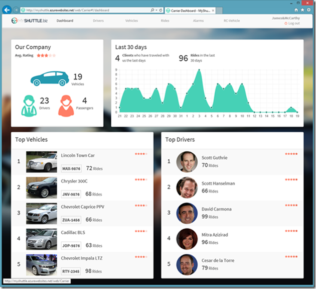

# Module 04: Controllers

Student Lab Manual

Instructor Edition (Book Title Hidden Style)

Version 3.0

**Conditions and Terms of Use**

Microsoft Confidential

This training package is proprietary and confidential, and is intended only for
uses described in the training materials. Content and software is provided to
you under a Non-Disclosure Agreement and cannot be distributed. Copying or
disclosing all or any portion of the content and/or software included in such
packages is strictly prohibited.

The contents of this package are for informational and training purposes only
and are provided "as is" without warranty of any kind, whether express or
implied, including but not limited to the implied warranties of merchantability,
fitness for a particular purpose, and non-infringement.

>   Training package content, including URLs and other Internet Web site
>   references, is subject to change without notice. Because Microsoft must
>   respond to changing market conditions, the content should not be interpreted
>   to be a commitment on the part of Microsoft, and Microsoft cannot guarantee
>   the accuracy of any information presented after the date of publication.
>   Unless otherwise noted, the companies, organizations, products, domain
>   names, e-mail addresses, logos, people, places, and events depicted herein
>   are fictitious, and no association with any real company, organization,
>   product, domain name, e-mail address, logo, person, place, or event is
>   intended or should be inferred.

© 2020 Microsoft Corporation. All rights reserved.

**Copyright and Trademarks**

© 2020 Microsoft Corporation. All rights reserved.

Microsoft may have patents, patent applications, trademarks, copyrights, or
other intellectual property rights covering subject matter in this document.
Except as expressly provided in written license agreement from Microsoft, the
furnishing of this document does not give you any license to these patents,
trademarks, copyrights, or other intellectual property.

Complying with all applicable copyright laws is the responsibility of the user.
Without limiting the rights under copyright, no part of this document may be
reproduced, stored in or introduced into a retrieval system, or transmitted in
any form or by any means (electronic, mechanical, photocopying, recording, or
otherwise), or for any purpose, without the express written permission of
Microsoft Corporation.

For more information, see Use of Microsoft Copyrighted Content at  
<http://www.microsoft.com/en-us/legal/intellectualproperty/Permissions/default.aspx>

Azure, Microsoft, SQL Server, and Visual Studio are either registered trademarks
or trademarks of Microsoft Corporation in the United States and/or other
countries. Other Microsoft products mentioned herein may be either registered
trademarks or trademarks of Microsoft Corporation in the United States and/or
other countries. All other trademarks are property of their respective owners.

Lab 3: Creating Controllers
===========================

#### Introduction

MyShuttle is a B2B highly scalable multi-tenant software as a service (SaaS)
solution that targets corporate scenarios in which carrier companies offer
transport services to enterprise customers.


This multi-tenant SaaS system would allow any number of carrier companies who
must be syndicated with the system, to provide their services (cabs/shuttles)
directly to any number of customer-enterprises/companies who would also be
registered in the MyShuttle.biz system. The final outcome is that any employee
in those customer companies would be able to request a cab/shuttle at any time
in any place/city without worrying about how to pay. Everything would take place
between their company and the carrier company for that ride.

The global scenario is described in the following image:


There are two web applications in the above scenario:

**Public Website:**

It is a typical public website. Its main purpose is to show information about
the business but in a modern and clean way. It provides a responsive design and
even if you resize the browser, you can see how it would also be perfectly valid
for mobile devices, like a smartphone.


**Private Web Application:**

The second application is a Web Single Page Application (SPA), which you can
access by logging in from the public website. However, in reality it is like a
different web application, simulating a private web application especially made
for the Carriers’ administrators.

This application is a data-driven and CRUD app so you can create and update
information about your drivers, vehicles, etc. This application consumes the
ASP.NET Core Web API Services using client-side frameworks.



In this series of labs, you will build the public website and some parts of the
private web application above.

The Model View Controller (MVC) architectural pattern separates an application
into three main components:

-   **Models:** Model objects are the parts of the application that implement
    the domain logic. Often, model objects also retrieve and store model state
    in a database.

-   **Views:** Views are the components that display the application's User
    Interface (UI). Usually, this UI is created from the model data. An example
    would be an edit view of a Products table that displays text boxes,
    drop-down lists, and check boxes based on the current state of a Product
    object.

-   **Controllers:** Controllers are the components that handle user
    interaction, manipulate the model, and ultimately select a view to render
    the UI. In an MVC application, the view only displays information; the
    controller handles and responds to user input and interaction.

The MVC pattern helps you to create applications that separate the different
aspects of the application (such as input logic, business logic, and UI logic),
while providing a loose coupling between these elements. This separation helps
you manage complexity when you build an application, because it allows you to
focus on one aspect of the implementation at a time. In addition to managing
complexity, the MVC pattern makes it easier to test applications than it is to
test a traditional ASP.NET Web application, encouraging the use of Test Driven
Development (TDD) to create an application.

The ASP.NET MVC framework provides an alternative to the ASP.NET Web Forms
pattern for creating MVC-based Web applications. The ASP.NET MVC framework is a
lightweight, highly testable, presentation framework (as with Web Forms-based
applications) that is integrated with existing ASP.NET features, such as master
pages and membership-based authentication.

In addition, the loose coupling between the three main components of an MVC
application also promotes parallel development. For instance, one developer can
work on the view, a second developer can work on the controller logic, and a
third developer can focus on the business logic in the model.

#### Overview

In this lab, you will:

-   Explore the role of controllers.

-   Understand how to create controllers.

-   Implement action methods.

#### Objectives

After completing this lab, you will:

-   Understand the basic principles of MVC.

-   Learn how to implement a controller and action methods.

-   Learn how to pass data to action methods.

-   Learn how to implement asynchronous action methods.

#### Prerequisites

None

#### Hosted Lab Credentials

If the lab is exercised in Microsoft cloud environment, use the following user
credentials to sign in:

-   Username: aspnetuser

-   Password: \@Cir9hvc6!w

#### Estimated Time to Complete This Lab

60 minutes

#### System Requirements

To complete this lab, you need:

-   Microsoft Visual Studio 2019 or higher

#### For more information, (if applicable)

Refer the following blog post to see how MyShuttle application interoperates
with a number of other client-side applications:

<http://blogs.msdn.com/b/cesardelatorre/archive/2014/11/30/myshuttle-biz-demo-apps-from-connect-visual-studio-and-azure-event.aspx>

Exercise 1: Create a Controller and Implement Action Methods
------------------------------------------------------------

#### Introduction

In ASP.NET Web Form applications, user interaction is organized around pages,
and around raising and handling events from those pages. In contrast, user
interaction with ASP.NET MVC applications is organized around controllers and
their action methods.

The ASP.NET MVC framework maps URLs to classes that are referred to as
controllers. Controllers process incoming requests, handle user input and
interactions, and execute appropriate application logic. A controller class
typically calls a separate view component to generate the HTML markup for the
request. In a MVC application, the view only displays information; the
controller handles and responds to user input and interaction.

#### Objectives

Learn to *create new controllers* and different types of Action methods for your
controllers.

#### Scenario

Create a new Controller.

In this exercise, you will:

-   Create Home Controller for MyShuttle application

-   Create CarrierList Controller for MyShuttle application

#### Task 1: Create Home Controller
Controllers are classes that handle incoming browser requests, retrieve model
data, and then specify view templates that return a response to the browser.

1. Make sure your default namespace is **MyShuttle.Web**. 
    - Right-click the project **MyShuttle.Web** > **Properties**
    - Go to the **Application** tab
    - Look at the **Default namespace** field. It should say **MyShuttle.Web**.

    


2.  In the Solution Explorer, add a new folder to the project **MyShuttle.Web**. Name it **Controllers**.

3.  Right-click the **Controllers** folder and **Add Controller**.

4.  Choose **MVC Controller – Empty**.

    

5.  Name the controller as **HomeController**, and click the **Add** button.

    

6.  You should see **HomeController.cs** with the **Index()** action method returning a view.

7.  In Solution Explorer, add a new folder to the project **MyShuttle.Web**. Name it **Models**. 

    This folder will contain models used by the controller to be displayed or sent to the user requests. This type of model is called a view-model. By convention and best practices, we will suffix any model class name with “ViewModel”.

8. Add a model class
    - Right-click the folder **Models** > **Add New Item** > **Class**
    - Name it **MyShuttleViewModel.cs**

9. Add a public property **MainMessage** of type `String` to your newly created **MyShuttleViewModel.cs** class:

```csharp
    MyShuttleViewModel.cs
    
    public class MyShuttleViewModel
    {
        public string MainMessage { get; set; }
    }
```

10. Switch over to **HomeController.cs**, and add the following *using* statement:
    
```csharp
    using MyShuttle.Web.Models;
```
    This let's us use the view-model in our controller class.

11. Refactor **HomeController.cs / Index()** like below:  

```csharp
    public class HomeController : Controller
    {
        public IActionResult Index()
        {
            var model = new MyShuttleViewModel()
            {
                MainMessage = "The Ultimate B2B Shuttle Service Solution"
            };

            return View(model);
        }
    }
```
    This sets the **MainMessage** property of the **MyShuttleViewModel** and returns the **ViewResult**.


12. Build the solution to make sure it builds successfully. 

13. At this point, the Solution Explorer should look like:

    


14. Currently, the HomeController only displays a simple message through the Index action method. To demonstrate some advanced features, we want this controller to interact with the Carrier information between the user requests and the application data.

    Let us add a couple of references to the **MyShuttle.Model** and **MyShuttle.Data** in the project if it’s not yet added.
    
    - Add the corresponding using directives in the **HomeController.cs** file:

```csharp
        using MyShuttle.Model;
        using MyShuttle.Data;
```


    - And add the references to those projects to our MyShuttle.Web project. Right-click **MyShuttle.Web > Add > Reference**.

15. Add the following code snippet at the top of the **HomeController.cs** class.

```csharp
    public class HomeController : Controller
    {
        private ICarrierRepository _carrierRepository;

        public HomeController(ICarrierRepository carrierRepository)
        {
            _carrierRepository = carrierRepository;
        }


        // Code excluded for brevity
    }
```

    You've just implemented **Dependency Injection** at the Controller level.

    *HomeController* now consumes the *CarrierRepository* service. All we need to do is tell the dependency container what the mapping between the interface and the concrete implementation is. This is done within the *Startup.cs* file.

16. Add a new folder to the project **MyShuttle.Web**. Name the folder as **AppBuilderExtensions**. 
    
    This folder will contain classes for configuration setup when the application first starts.

17. Add a new class to the **AppBuilderExtensions** folder. Name it **DependenciesExtensions.cs**.

18. Replace the **DependenciesExtensions.cs** class code with the following:

```csharp
    using Microsoft.Extensions.DependencyInjection;
    using MyShuttle.Data;

    namespace MyShuttle.Web.AppBuilderExtensions
    {
        public static class DependenciesExtensions
        {

            public static IServiceCollection ConfigureDependencies(this IServiceCollection services)
            {
                services.AddScoped<MyShuttleContext>();
                services.AddScoped<ICarrierRepository, CarrierRepository>();
                return services;
            }
        }
    }
```

    In *DependenciesExtensions.cs*, we have added a *CarrierRepository* service to the collection. When an instance of the repository is needed, the framework injects this instance to the objects that needs it (for example, into the *HomeController*).

19. Open the **Startup.cs** file. Add the *using* statement for the
    AppBuilderExtensions namespace.
    
```csharp
    using MyShuttle.Web.AppBuilderExtensions;
```

20. Add the following line in the **Startup.cs / ConfigureServices()** method:

```csharp
    services.ConfigureDependencies();
```
21. Navigate back to the **HomeController.cs** file. Add another action method, which will be used for adding a new carrier by calling the carrier repository. Decorate it with [HttpPost] attribute. Your final HomeController class should look like the following:

```csharp
    using System.Threading.Tasks;
    using Microsoft.AspNetCore.Mvc;
    using MyShuttle.Data;
    using MyShuttle.Model;
    using MyShuttle.Web.Models;

    namespace MyShuttle.Web.Controllers
    {
        public class HomeController : Controller
        {
            private ICarrierRepository _carrierRepository;

            public HomeController(ICarrierRepository carrierRepository)
            {
                _carrierRepository = carrierRepository;
            }

            public IActionResult Index()
            {
                var model = new MyShuttleViewModel()
                {
                    MainMessage = "The Ultimate B2B Shuttle Service Solution"
                };

                return View(model);
            }

            [HttpPost]
            public async Task<int> Post([FromBody]Carrier carrier)
            {
                return await _carrierRepository.AddAsync(carrier);
            }
        }
    }
```

22.  Build the solution to ensure it builds successfully.

We’ve just created a controller and implemented dependency injection at the controller level. Let’s create another controller next.

#### Task 2: Create CarrierList Controller for the Application

1. Let's add another controller to handle more specific information related to the Carrier model. 
    - Right-click the **Controllers** folder
    - Select **Add > Controller**.
    - Select **MVC Controller – Empty** from the scaffolding templates
    - Name the class as **CarrierListController.cs**, and then click **Add**.

2. Replace default code in **CarrierListController.cs** with the following code:

    Note that at this point there will be some unresolved dependencies (SearchViewModel and CarrierListViewModel) – these will be addressed in the next few steps.

```csharp
    using System.Threading.Tasks;
    using Microsoft.AspNetCore.Mvc;
    using MyShuttle.Data;
    using MyShuttle.Web.Models;

    namespace MyShuttle.Web.Controllers
    {
        public class CarrierListController : Controller
        {
            private ICarrierRepository _carrierRepository;

            public CarrierListController(ICarrierRepository carrierRepository)
            {
                _carrierRepository = carrierRepository;
            }

            public async Task<IActionResult> Index(SearchViewModel searchVM)
            {
                string searchString = searchVM == null ? null : searchVM.SearchString;
                var carriers = await _carrierRepository.GetCarriersAsync(searchString);
                var model = new CarrierListViewModel(carriers);

                return View("Index", model);
            }
        }
    }
```

3. Sometimes, action methods may execute for a long time to get what the user needs. You may want to speed up the execution by running the long-running tasks in parallel to reduce the request execution time.

    We will invoke *GetCarriersAsync* method to fetch all Carriers and pass the result to the View if the search criteria matches.

    - In the **MyShuttle.Web** project, right-click **Models > Add
    Existing Item.**

    - Navigate to this lab assets location `..\Assets\MyShuttle\Models` and add CarrierListViewModel.cs, CarrierViewModel.cs, and SearchViewModel.cs:

        

4. Build the solution to ensure it builds successfully.

Exercise 2: Run MyShuttle.Web Application
-----------------------------------------

#### Objectives

In this exercise, you will:

-   Test run the application and make sure there is no error.

-   Look at how to add MVC into the hosting pipeline.

#### Task 1: Test Run the Application

So far we have created the related models and controllers for our MVC
application. We would want to ensure that everything is working properly.

1.  Right-click the project **MyShuttle.Web >Debug > Start new
    instance.** If everything is working properly, you should see a blank page
    with **“Hello World!”** message.

    If there is any message of the type “unable to unload the appdomain”, make sure that all the dependencies versions match the ones from the lab, and also make sure the port number specified in the project properties under “Web Server Settings” is higher than 1024, choosing something like 4000 usually works well.

    

    By default, the web application is hosted in **IIS Express** to serve the page.

2. Let's make use of the self-hosting feature of ASP.NET Core and start the web application from the command line.
    - Open the Command Prompt - from the Windows Start menu
    - Navigate to the MyShuttle.Web project folder by typing:  
        `cd "C:\...\MyShuttle\MyShutle"`. 
   
        (You can grab the folder location in Visual Studio by right-clicking **MyShuttle.Web > Open Folder in File Explorer**)
    - To start up the **dotnet.exe** process, type:  
     `dotnet run`. 

    

    CLI may initially populate your local package cache, to improve restore speed and enable offline access. This command may take a few minutes depending on the Internet speed.

    

3. Open a browser and navigate to [http://localhost:[YOUR LOCALHOST PORT]](http://localhost:5000). You should see the same “**Hello World!**” page.

4. This page is the result of a default injection into the Response pipeline as an example. Open **Startup.cs / Configure()**, and look at the code that does this:

```csharp
    public void Configure(IApplicationBuilder app, IWebHostEnvironment env)
    {
        // Code excluded for brevity

        app.Run(async (context) =>
        {
            await context.Response.WriteAsync("Hello World!");
        });

        }
    }
```

5.  We’ve ran our application with VS 2019 and with the command line. In the next task, we will look into how to enable MVC content to be processed and returned by the hosting server/process.

6. Go back to the Command Prompt and enter:

    `Ctrl + C `

    This will end the process and shut down the application. You will see a message confirming that it has shut down. You may have to enter `Ctrl + C ` several times.

#### Task 2: Enabling MVC and Run a Simple Test

Before we can test our MVC application, we need to setup a “View” for our
controllers. We will go into the details about Views in the next lab. For
testing purposes, we will just create a simple View page.

1. Add a folder to our **MyShuttle.Web** project. Name it **Views**.

2. Under the newly created **Views** folder, add another folder. Name it **Home**. 
The Home folder will contain Views related to our *HomeController* class.

    

3. Right-click the newly created folder **Home > Add > View.** Name it **Index**. 

    

4. Solution Explorer should look like the following by now.

    

5. Open the **Index.cshtml** file and replace with the following markup script and save the file:

```csharp
    @model MyShuttle.Web.Models.MyShuttleViewModel

    @{
        ViewBag.Title = "Home Page";
    }

    @Model.MainMessage
```

    This will display the message that we have set in the *HomeController* from Exercise 1.

6. Next, we will add the MVC services to the service container in **Startup.cs / ConfigureServices()** as follows:

```csharp
    public void ConfigureServices(IServiceCollection services)
    {
        services.ConfigureDependencies();
        services.AddMvc();
        services.AddMvc(options => options.EnableEndpointRouting = false);
    }
```

    Make sure to add the following using statement:

```csharp
    using MyShuttle.Web.AppBuilderExtensions;
```


7. The final step to enabling MVC is to add it to the request pipeline. We also need to specify how the request can reach MVC by specifying the default route in **Startup.cs / Configure()**. The Configure method should look like the following:

```csharp
    public void Configure(IApplicationBuilder app, IWebHostEnvironment env)
    {
        if (env.IsDevelopment())
        {
            app.UseDeveloperExceptionPage();
        }

        app.UseMvc(routes =>
        {
            routes.MapRoute(
                name: "Default",
                template: "{controller}/{action}/{id?}",
                defaults: new { controller = "Home", action = "Index" });

        });
    }
```


    Notice that we have removed the code for displaying “**Hello World!**”.

    >**Important!** The build will **`FAIL`** at this point.  
    >
    >We are not ready to run the application just yet. Remember that
    in the *HomeController*, we have injected the *CarrierRepository* service. So the controller is expecting the concrete service to be passed in. However, we have not setup all the data context configuration yet.

8. **Only for this test run**, we would need to comment out the *HomeController* constructor, *\_carrierRepository* field and the *Post* method to avoid any dynamic data references. This is to test the MVC middleware from the previous step.

    The **HomeController.cs** should look like:

```csharp
    using System.Threading.Tasks;
    using Microsoft.AspNetCore.Mvc;
    using MyShuttle.Data;
    using MyShuttle.Model;
    using MyShuttle.Web.Models;

    namespace MyShuttle.Web.Controllers
    {
        public class HomeController : Controller
        {
            //private ICarrierRepository _carrierRepository;

            //public HomeController(ICarrierRepository carrierRepository)
            //{
            //    _carrierRepository = carrierRepository;
            //}

            public IActionResult Index()
            {
                var model = new MyShuttleViewModel()
                {
                    MainMessage = "The Ultimate B2B Shuttle Service Solution"
                };

                return View(model);
            }

            //[HttpPost]
            //public async Task<int> Post([FromBody]Carrier carrier)
            //{
            //    return await _carrierRepository.AddAsync(carrier);
            //}
        }
    }
```

9. After the changes, click the **Debugging** button in **Visual Studio** with the **IIS Express** option selected. You should see a page with the message **“The Ultimate B2B Shuttle Service Solution”**.

    

    You have successfully gotten an ASP.NET Core application running!

10. Now **uncomment** the *HomeController constructor* and the *Post method*, for our next task.

    The **HomeController.cs** should now look like:

```csharp
    using System.Threading.Tasks;
    using Microsoft.AspNetCore.Mvc;
    using MyShuttle.Data;
    using MyShuttle.Model;
    using MyShuttle.Web.Models;

    namespace MyShuttle.Web.Controllers
    {
        public class HomeController : Controller
        {
            private ICarrierRepository _carrierRepository;

            public HomeController(ICarrierRepository carrierRepository)
            {
                _carrierRepository = carrierRepository;
            }

            public IActionResult Index()
            {
                var model = new MyShuttleViewModel()
                {
                    MainMessage = "The Ultimate B2B Shuttle Service Solution"
                };

                return View(model);
            }

            [HttpPost]
            public async Task<int> Post([FromBody]Carrier carrier)
            {
                return await _carrierRepository.AddAsync(carrier);
            }
        }
    }
```


#### Task 3: Setup the Rest of the Project for Testing Data Driven Features

Our next step is to test the data driven part of the application. But we need to setup properly all the data dependencies.

1. Add a database connection string configuration.  
- Right-click **MyShuttle.Web > Add > Existing Item**
- Navigate to the **Assets** folder for this lab 
- Select the **config.json** file. Click the **Add** button. We will use the **LocalDB** to store our Carrier data.

    

2. Add **Microsoft.EntityFrameworkCore.InMemory** (version 3.1.3) NuGet package to the **MyShuttle.Web** project.

3. Add some AppBuilder extensions:
    - Right-click **AppBuilderExtensions** project folder > **Add  > Existing Item.** 
    - Navigate to the **Assets** folder for this lab and select **DataContextExtensions.cs** and **RoutesExtensions.cs.**

        

        **DataContextExtensions.cs**: Tell the data context to use SQL Server.

        **RoutesExtensions.cs**: Refactoring the routing specification into an extension methods for IApplicationBuilder.

4. Open **Program.cs** and update the class namespace to **MyShuttle.Web**.

5. Open **Startup.cs**, at the top add the Configuration property, and the following Startup constructor:

```csharp
    public class Startup
    {
        public IConfiguration Configuration { get; private set; }

        public Startup(IWebHostEnvironment env)
        {
            var config = new ConfigurationBuilder()
                .AddJsonFile("config.json", optional: true)
                .SetBasePath(env.ContentRootPath)
                .Build();

            Configuration = config;
        }

        
        // Code excluded for brevity
    }
```

    This is where we are hooking up our configurations upon the start of our application. Add Using statement  **Microsoft.Extensions.Configuration**

6. In the **Startup.cs / ConfigureServices()** method, add the following changes:

```csharp
    public void ConfigureServices(IServiceCollection services)
    {
        services.ConfigureDataContext(Configuration);

        services.AddIdentity<ApplicationUser, IdentityRole>()
            .AddEntityFrameworkStores<MyShuttleContext>()
            .AddDefaultTokenProviders();

        services.ConfigureDependencies();

        services.AddMvc();
        services.AddMvc(options => options.EnableEndpointRouting = false);
    }
```
    Make sure to add the appropriate using statements for MyShuttle.Data and MyShuttle.Model;

7. In **Startup.cs**, replace the **Configure()** with the code below:

```csharp
    public void Configure(IApplicationBuilder app)
    {
        app.ConfigureRoutes();
    }
```


8.  When you’re done, the **Startup.cs** should look like this:

```csharp
    using Microsoft.AspNetCore.Builder;
    using Microsoft.AspNetCore.Hosting;
    using Microsoft.AspNetCore.Identity;
    using Microsoft.Extensions.Configuration;
    using Microsoft.Extensions.DependencyInjection;
    using MyShuttle.Data;
    using MyShuttle.Model;
    using MyShuttle.Web.AppBuilderExtensions;

    namespace MyShuttle
    {
        public class Startup
        {
            public IConfiguration Configuration { get; private set; }

            public Startup(IWebHostEnvironment env)
            {
                var config = new ConfigurationBuilder()
                    .AddJsonFile("config.json", optional: true)
                    .SetBasePath(env.ContentRootPath)
                    .Build();

                Configuration = config;
            }

            // This method gets called by the runtime. Use this method to add services to the container.
            // For more information on how to configure your application, visit https://go.microsoft.com/fwlink/?LinkID=398940
            public void ConfigureServices(IServiceCollection services)
            {
                services.ConfigureDataContext(Configuration);

                services.AddIdentity<ApplicationUser, IdentityRole>()
                    .AddEntityFrameworkStores<MyShuttleContext>()
                    .AddDefaultTokenProviders();

                services.ConfigureDependencies();
                services.AddMvc();
                services.AddMvc(options => options.EnableEndpointRouting = false);
            }

            // This method gets called by the runtime. Use this method to configure the HTTP request pipeline.
            public void Configure(IApplicationBuilder app)
            {
                app.ConfigureRoutes();
            }

        }
    }
```

9. In the **Program.cs** file, replace the **Main()** method with the code below:

```csharp
    public static void Main(string[] args)
    {
        var host = CreateHostBuilder(args).Build();

        using (var scope = host.Services.CreateScope())
        {
            var services = scope.ServiceProvider;

            try
            {
                MyShuttleDataInitializer.InitializeDatabaseAsync(services).Wait();
            }
            catch (Exception ex)
            {
                var logger = services.GetRequiredService<ILogger<Program>>();
                logger.LogError(ex, "An error occurred seeding the DB.");
            }
        }

        host.Run();
    }
```

------
**Note** that we can rewrite the following code (which is the default in
Main()):

```
CreateHostBuilder(args).Build().Run();
```

We can rewrite it to look like the code below:

```
var host = CreateHostBuilder(args).Build();
host.Run();
```

Those two code snippets do the same thing.

-----------

10. Review and understand the setup for the different components in the Startup.cs and Program.cs files.

11. Right-click the **Views** folder > **Add > New Folder.** Name it **CarrierList**. 
This folder will contain Views related to our *CarrierListController* class.

12. Right-click the **CarrierList** folder > **Add > Existing Item.** In the dialog box, navigate to the lab Assets location and add the `…/CarrierList/index.cshtml`.

    

13. The **MyShuttle.Web** project should look like this:

    

14. We finally can test our application again. click the **Debugging** button in **Visual Studio** with the **IIS Express** option selected. You should see a page with the message **“The Ultimate B2B Shuttle Service Solution”**.

15. In the browser address bar, append `http://.../carrierlist/index` and press the **Enter** key. You should see the number **8**, which means there are eight records in the database.

    