# Module 05: Views and Razor Views

Student Lab Manual

Instructor Edition (Book Title Hidden Style)

**Conditions and Terms of Use**

Microsoft Confidential

This training package is proprietary and confidential, and is intended only for
uses described in the training materials. Content and software is provided to
you under a Non-Disclosure Agreement and cannot be distributed. Copying or
disclosing all or any portion of the content and/or software included in such
packages is strictly prohibited.

The contents of this package are for informational and training purposes only
and are provided "as is" without warranty of any kind, whether express or
implied, including but not limited to the implied warranties of merchantability,
fitness for a particular purpose, and non-infringement.

Training package content, including URLs and other Internet Web site references,
is subject to change without notice. Because Microsoft must respond to changing
market conditions, the content should not be interpreted to be a commitment on
the part of Microsoft, and Microsoft cannot guarantee the accuracy of any
information presented after the date of publication. Unless otherwise noted, the
companies, organizations, products, domain names, e-mail addresses, logos,
people, places, and events depicted herein are fictitious, and no association
with any real company, organization, product, domain name, e-mail address, logo,
person, place, or event is intended or should be inferred.

© 2020 Microsoft Corporation. All rights reserved.

**Copyright and Trademarks**

© 2020 Microsoft Corporation. All rights reserved.

Microsoft may have patents, patent applications, trademarks, copyrights, or
other intellectual property rights covering subject matter in this document.
Except as expressly provided in written license agreement from Microsoft, the
furnishing of this document does not give you any license to these patents,
trademarks, copyrights, or other intellectual property.

Complying with all applicable copyright laws is the responsibility of the user.
Without limiting the rights under copyright, no part of this document may be
reproduced, stored in or introduced into a retrieval system, or transmitted in
any form or by any means (electronic, mechanical, photocopying, recording, or
otherwise), or for any purpose, without the express written permission of
Microsoft Corporation.

For more information, see Use of Microsoft Copyrighted Content at  
<http://www.microsoft.com/en-us/legal/intellectualproperty/Permissions/default.aspx>

Microsoft, SQL Server, and Visual Studio are either registered trademarks or
trademarks of Microsoft Corporation in the United States and/or other countries.
Other Microsoft products mentioned herein may be either registered trademarks or
trademarks of Microsoft Corporation in the United States and/or other countries.
All other trademarks are property of their respective owners.

Lab 4: Creating Views 
======================

#### Introduction 

The aim of this exercise is to explore the role of views, how to create views
and learn Razor syntax.

MyShuttle is a B2B highly scalable multi-tenant software as a service (SaaS)
solution that targets corporate scenarios in which carrier companies offer
transport services to enterprise customers.


This multi-tenant SaaS system would allow any number of carrier companies who
must be syndicated with the system, to provide their services (cabs/shuttles)
directly to any number of customer-enterprises/companies who would also be
registered in the MyShuttle.biz system. The final outcome is that any employee
in those customer companies would be able to request a cab/shuttle at any time
in any place/city without worrying about how to pay. Everything would take place
between their company and the carrier company for that ride.

The global scenario is described in the following image:

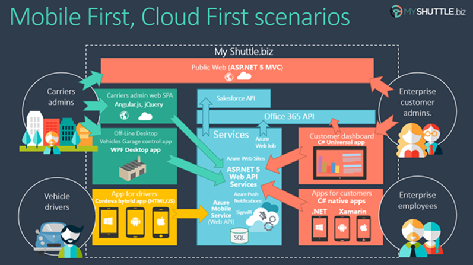

There are two web applications in the above scenario:

**Public Website:**

It is a typical public website. Its main purpose is to show information about
the business but in a modern and clean way. It provides a responsive design and
even if you resize the browser, you can see how it would also be perfectly valid
for mobile devices, like a smartphone.

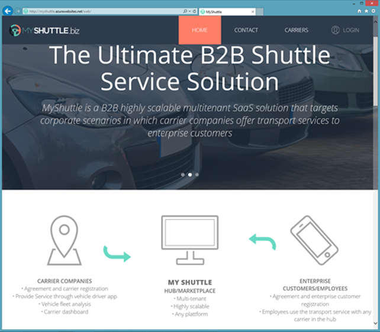

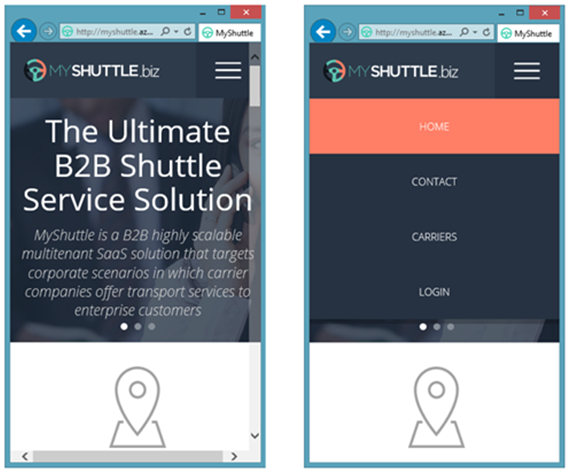

**Private Web Application:**

The second application is a Web Single Page Application (SPA), which you can
access by logging in from the public website. However, in reality it is like a
different web application, simulating a private web application especially made
for the Carriers’ administrators.

This application is a data-driven and CRUD app so you can create and update
information about your drivers, vehicles, etc. This application consumes the
ASP.NET Core Web API Services using client-side frameworks.

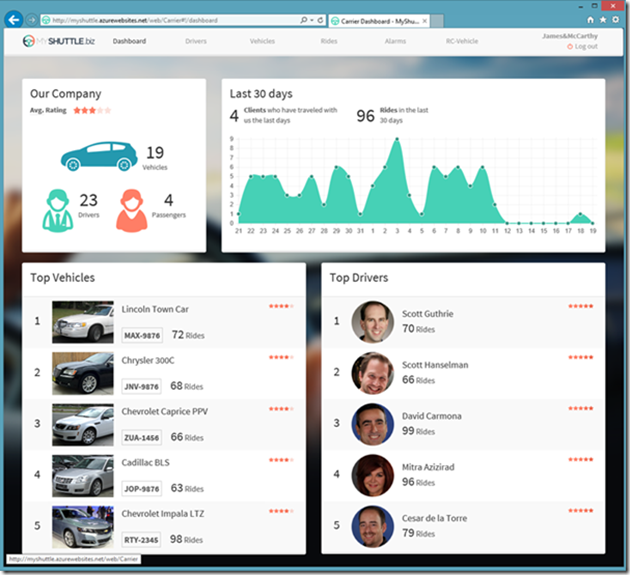

In this series of labs, you will build the public website and some parts of the
private web application above.

#### Overview

The Model View Controller (MVC) architectural pattern separates an application
into three main components:

-   **Models:** Model objects are the parts of the application that implement
    the domain logic. Often, model objects also retrieve and store model state
    in a database

-   **Views:** Views are the components that display the application's User
    Interface (UI). Typically, this UI is created from the model data. An
    example would be an edit view of a Products table that displays text boxes,
    drop-down lists, and checkboxes based on the current state of a Product
    object.

-   **Controllers:** Controllers are the components that handle user
    interaction, manipulate the model, and ultimately select a view to render
    the UI. In an MVC application, the view only displays information; the
    controller handles and responds to user input and interaction.

The MVC pattern helps you to create applications that separate the different
aspects of the application (input logic, business logic, and UI logic), while
providing a loose coupling between these elements. This separation helps you
manage complexity when you build an application, because it enables you to focus
on one aspect of the implementation at a time. In addition to managing
complexity, the MVC pattern makes it easier to test applications than it is to
test a traditional ASP.NET Web application, encouraging the use of Test-Driven
Development (TDD) for creating an application.

Then, the ASP.NET MVC framework provides an alternative to the ASP.NET Web-forms
pattern for creating MVC-based Web applications. The ASP.NET MVC framework is a
lightweight, highly testable presentation framework that (as with
Web-forms-based applications) is integrated with existing ASP.NET features, such
as master pages and membership-based authentication.

In addition, the loose coupling between the three main components of an MVC
application also promotes parallel development. For instance, one developer can
work on the view, a second developer can work on the controller logic, and a
third developer can focus on the business logic in the model.

#### Objectives

After completing this lab, you will be able to:

-   Understand the basic principles of MVC.

-   Learn how to implement a view in Razor view engines.

-   Learn how to pass data from controllers to views.

-   Learn how to implement GET, POST scenarios.

#### Scenario

In this scenario, we will explore MVC Views.

#### System Requirements

To complete this lab, you need:

-   Microsoft Visual Studio 2019 or higher

-   Microsoft SQL Server (any edition)

#### Estimated Time to Complete This Lab 

60-90 minutes

Exercise 1: Explore ASP .NET MVC View Files Structure
-----------------------------------------------------

#### Objectives

In this exercise, you will:

-   Create a new ASP.NET MVC application in Visual Studio 2019.

-   Explore the view organization within the Views folder of Visual Studio
    project.

#### Scenario

We are going to take a break from the MyShuttle project. We're going to start by creating a new MVC application and exploring view organization. 

#### Task 1: Creating a new project 

1. Open **Visual Studio 2019**.

2.  Create a new project.

3. Choose the **ASP.NET Core Web Application** template.

    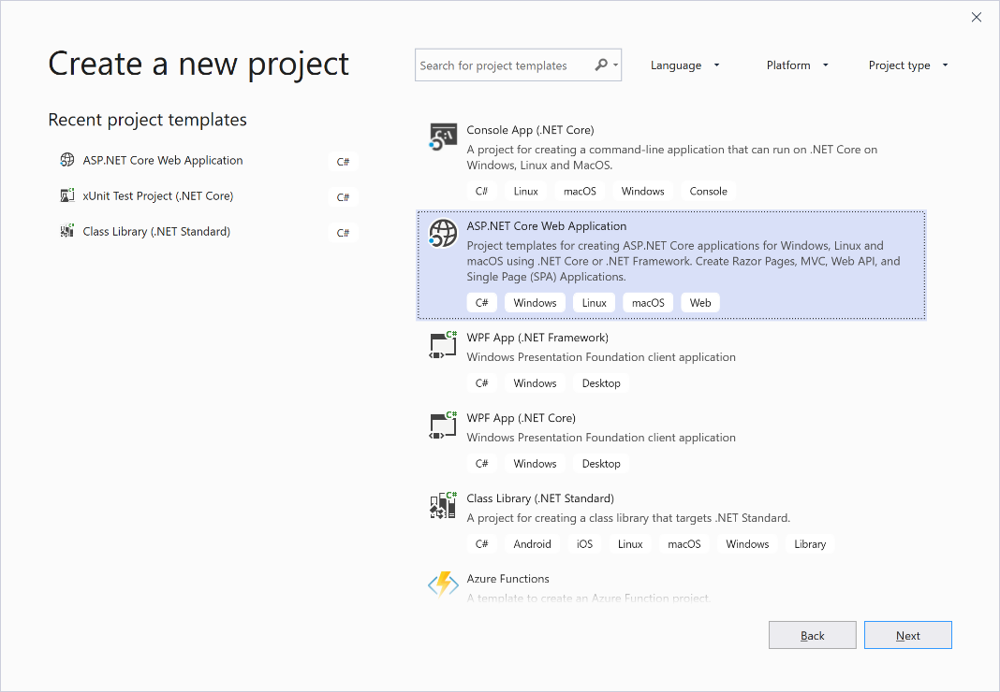

4. Name the project *ViewsLab* and click **Create**.

5. Select **Web Application (Model-View-Controller)** project template. Choose **Individual User Accounts** for application authentication.

    

    And choose **Store user accounts in-app** from the drop-down. 

    

6. Click **Create**.


1.  Double-click any controller class or a view to see its codebase.

    Note that the Home controller is included in the project by default. The **HomeController** handles the default first view of the web application.

    Also notice here that all views used by **HomeController** are in **Views** \> **Home** folder. This is the default convention, but it can be overridden.

    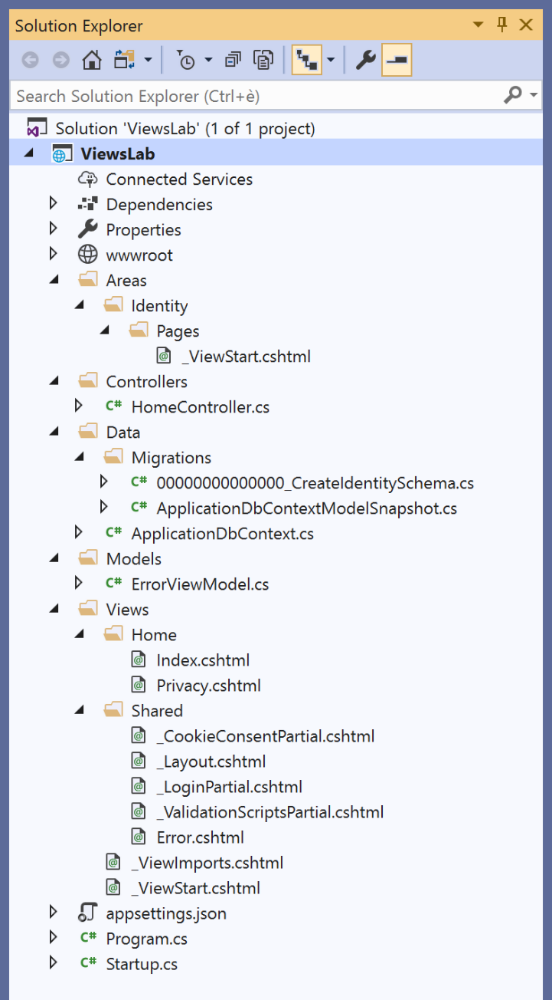


Exercise 2: View Creation and Data Passage
------------------------------------------

In the typical workflow of an MVC Web application, controller action methods
handle an incoming Web request. These action methods use the incoming parameter
values to execute application code, and retrieve or update data model objects
from a database. They then select a view that renders a response to a browser.

In an MVC application, the views are the components responsible for displaying
the application's user interface. Views are intended exclusively for
encapsulating presentation logic. They should not contain any application logic
or database retrieval code. Views render the appropriate UI by using this **View
Data class**, which is a MVC view-related data object that the controller
provides when it calls the method to render the view.

If ASPX view engine is used, the views use .aspx, .ascx, and .master files, as
well as any other files that are related to rendering views. Views use .cshtml
or .vbhtml if Razor engine is used. The Views folder contains a folder for each
controller that is named with the controller prefix.

#### Objectives

In this exercise, you will:

-   Explore Views

-   Explore Razor view engine

#### Scenario

Razor is the default view engine but MVC supports multiple view engines.

#### Task 1: Exploring Razor

Continuing with our ViewsLab project:

1. Click on **Views > Home > Index.cshtml**.  

    This is the first view displayed when the application runs. This Index view is created by default when we create our project with the *Web Application (Model-View-Controller)* project template.

    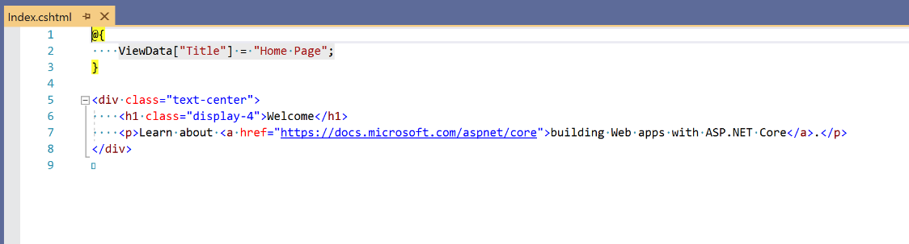

2. To create a view, you can do it either through the Solution Explorer or
    action method code. When a view is created in the context of action method (by right-clicking action method signature), the view is created specifically for that particular action method. 
    
    Let's create a view through **Solution Explorer**.
    - From the **Views** folder, right-click **Home** folder > **Add** > **View...**.  
    - Name it **SampleView.cshtml**.

        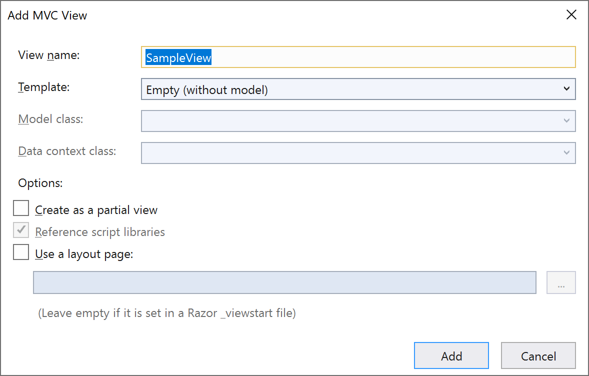

3. The view created looks like below. It is very different from the Index view:

    

    **Note:** By default, the created view uses a layout for implementing a universal look throughout the website or web application. You can always point
    to a different layout file globally or per view. The layout specification is
    located in the \_ViewStart.cshtml file.

4. Replace the view code with the following:

```html
    @{
        ViewBag.Title = "My View Sample";
    }

    <h2>@ViewBag.Title</h2>
```

5. After the view is created, a controller action method can use it. 

    If you want to return the view, **SampleView.cshtml**, from Index action method of HomeController, you need to ensure that the view file is placed under **Views > Home** folder.

    

6.  In the **HomeController.cs / Index()**, modify the *Index()* action method to specifically return the **SampleView.cshtml** view. Currently it returns the *Index.cshtml* view.

```csharp
    public class HomeController : Controller
    {
        public IActionResult Index()
        {
            return View("SampleView");
        }

        // Code excluded for brevity
    }
```
    
7.  Run the application. 

    The default view should now return the **SampleView** view as shown below:

    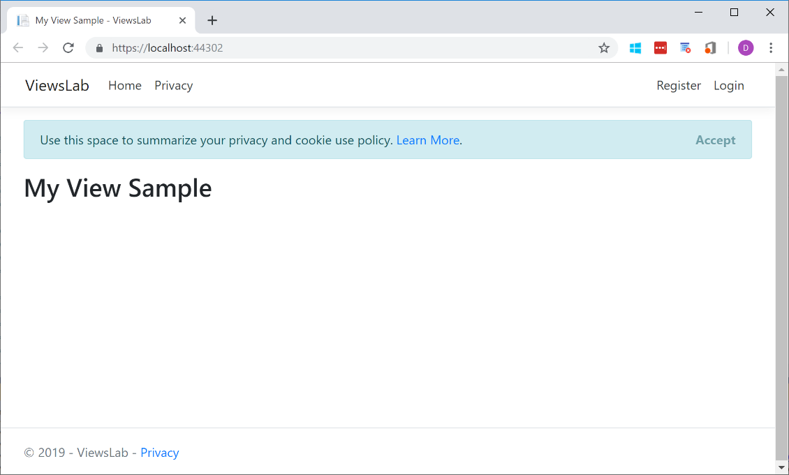

8.  Modify the **HomeController.cs / Index()** method as shown below.

```csharp
    public IActionResult Index()
    {
        ViewBag.Message = "I am learning ASP.NET Core MVC";
        return View("SampleView");
    }
```

    >   The controller manipulates a model and selects a view to display the model.
    >   Hence, it needs to pass the model data to the view to display it. There are
    >   several ways to do so. One way is to use **ViewData**. ViewData is a
    >   container to pass data from a Controller to View.
    >
    >   A simpler way to pass data is to use **ViewBag**. ViewBag is a dynamic
    >   wrapper around ViewData. Since it is dynamic, it only supports keys that
    >   form a valid identifier in the language. For example, *‘My Message’* is not
    >   a valid key, but *MyMessage* will work.

9.  Show the passed data in **SampleView.cshtml**. Access **ViewBag** data in
    the view.

```html
    <h3>@ViewBag.Message</h3>
```

10. As you may already have noticed, you can add **C\#** syntax code to a page
    by using the **\@** character. This is called Razor syntax. The **\@** character starts inline expressions, single statement blocks, and multi-statement blocks. 
    
    Add the following at the end of **SampleView.cshtml**.


```html
    <!-- Single statement blocks -->
    @{ var total = 7; }
    @{ var myMessage = "Hello World"; }

    <!-- Inline expressions -->
    <p>The value of your account is: @total </p>
    <p>The value of myMessage is: @myMessage</p>

    <!-- Multi-statement block -->
    @{
        var greeting = "Welcome to our site!";
        var weekDay = DateTime.Now.DayOfWeek;
        var greetingMessage = greeting + " Today is: " + weekDay;
    }

    <p>The greeting is: @greetingMessage</p>
```
11. Open the **Privacy.cshtml** file under the *Views/Home* folder. And type the following code:
 
 ```html
    @for (int i = 0; i < 5; i++)
    {
        <blockquote>Message @i</blockquote>
    }
```

12. Start debugging by clicking the **IIS Express** button.

13. **SampleView** view will look like following:

    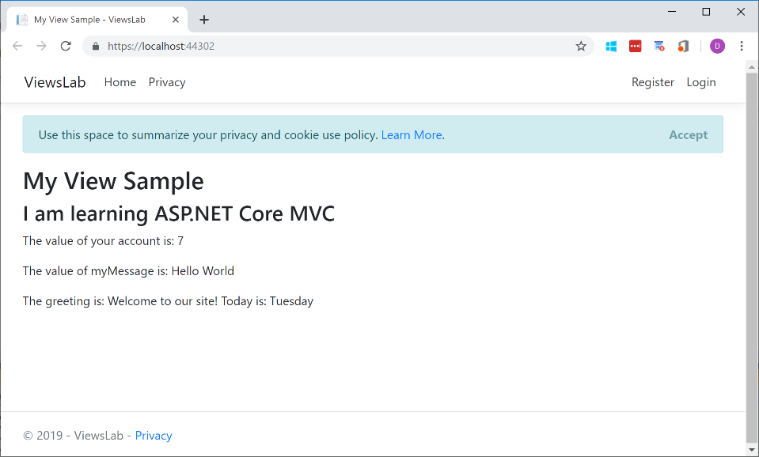

14. Navigate to **Privacy** view. Notice the simplicity of Razor for rendering the list on the page:

    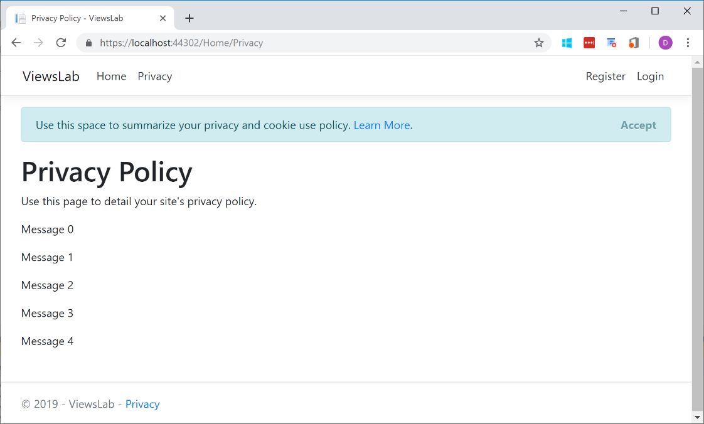
    

Exercise 3: Strongly Typed Views
--------------------------------

#### Objectives

In this exercise, you will:

-   Learn how to create strongly typed view against a model.

#### Scenario

Strongly typed views allow for easier binding to models through the controllers.

#### Task 1: Create a Model and Bind It to a View

1. In the **ViewsLab** project created earlier, add a new model.
    - Right-click the **Models** folder > **Add** \> **New Item**.
    - Choose **Class** from available templates 
    - Name it **MovieModel.cs**

3. Remove all code snippets and paste the following code into **MovieModel.cs**:

```csharp
    using System;

    namespace ViewsLab.Models
    {
        public class Movie
        {
            public int ID { get; set; }
            public string Title { get; set; }
            public DateTime ReleaseDate { get; set; }
        }
    }
```

3. In the **HomeController.cs / Privacy ()** method, change the Privacy action method as follows. First we create a movie object, and then we pass the movie object to the View method.

```csharp
    public IActionResult Privacy()
    {
        ViewData["Message"] = "Your application description page.";

        ViewsLab.Models.Movie movie = new ViewsLab.Models.Movie
        {
            ID = 1,
            Title = "Follow the Wind",
            ReleaseDate = new DateTime(2017, 01, 21)
        };

        return View(movie);
    }
```


4. Make the Privacy view strongly typed. To do that, open the
    **View / Home / Privacy.cshtml** file and add at the top of the page a reference
    to the Movie model namespace:

```html
    @using ViewsLab.Models

    @model Movie
```


5. Now we should be able to access the Movie object within this view. 

    Comment out or remove the for-loop from the previous exercise. And add the follow code snippet in **Privacy.cshtml**. 

```html
    <ul>
        <li>ID: @Model.ID</li>
        <li>Title: @Model.Title</li>
        <li> Release: @Model.ReleaseDate.ToString("ddd d MMM yyyy", new System.Globalization.CultureInfo("en-US"))</li>
    </ul>
```

    Notice that we have access to IntelliSense in the Views. The page should show the same values that we have instantiated in the **HomeController.cs / Privacy()** action method:

    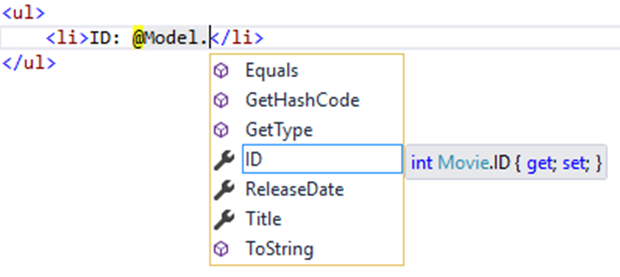


6. Run the application and click the **Privacy** menu. You should see the movie information that we have instantiated in the **HomeController**.

    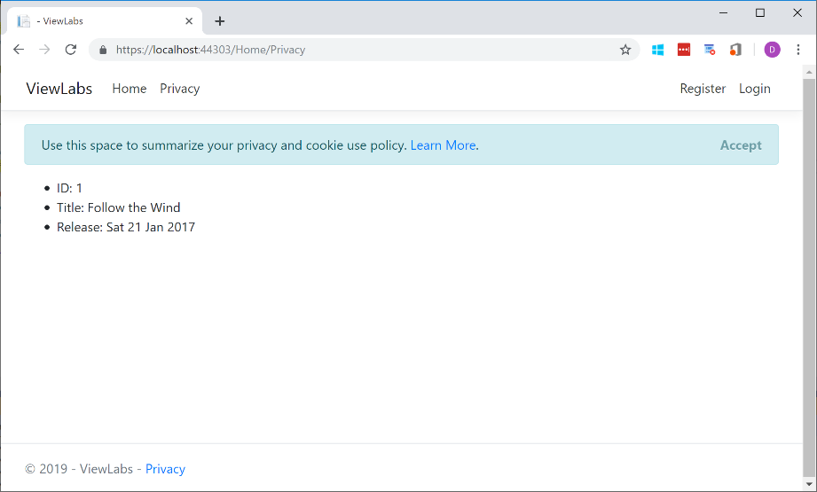

7. With strongly typed views, we can display dynamic data to the page.

    Let’s write html for an input form representing the Movie object properties
    and labels for name labeling.

    Add the following code to the end of **Privacy.cshtml:**

```html
    <form>
        <label for="ID">ID: </label>
        <input type="text" id="id" />

        <label for="Title">Title: </label>
        <input type="text" id="title" />

        <label for="ReleaseDate">Release Date: </label>
        <input type="text" id="releasedate" />

        <button type="submit">Submit</button>
    </form>
```

8. We have a form but we cannot post the data back to the server yet. The `asp-` attributes are called Tag Helpers. They enable server-side code to help create and render HTML elements in Razor files:

    **Modify** the above code with the following `asp-` attributes in the `<form>` and `<input>` elements:

```html
    <form asp-controller="Home" asp-action="Privacy" method="post">
        <label for="ID">ID: </label>
        <input type="text" asp-for="ID" id="id" />

        <label for="Title">Title: </label>
        <input type="text" asp-for="Title" id="title" />

        <label for="ReleaseDate">Release Date: </label>
        <input type="text" asp-for="ReleaseDate" id="releasedate" />

        <button type="submit">Submit</button>
    </form>
```

9. To post the data back to the server, we need to create an action method to handle HTTP Post method.

    In **HomeController.cs**, create a *new* **Privacy()** method that takes one parameter:

```csharp
    [HttpPost]
    public IActionResult Privacy(Models.Movie movieIncoming)
    {
        // Your logic here

        return View(movieIncoming);
    }
```

10. Let's test our application and the new **Privacy()** method we implemented:
    - Put a breakpoint at the line return `View(movieIncoming);` 
    - Debug the application via **IIS Express**
    - Navigate to the **Privacy** page
    - Enter some data in the fields and click the **Submit** button
    - You should then hit the break point. Inspect the object **movieIncoming** being returned:

    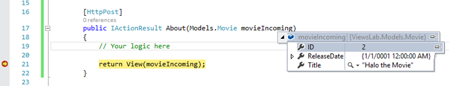

11. Open **MovieModel.cs**. 

    Note how the properties we saw during debug (or in the screenshot above) are the same properties we defined earlier in the *Movie* model.
 
    


Exercise 4: Create Index View for MyShuttle app
-----------------------------------------------

#### Objective 

In this exercise, you will:

-   Create Index.cshtml View for Home Controller in MyShuttle application.

#### Task 1: Create layout.cshtml page

Let's return back to our MyShuttle application. 

We are tasked to create the Home and Carriers pages. The company marketing and
design teams have come up with the following mock-ups:

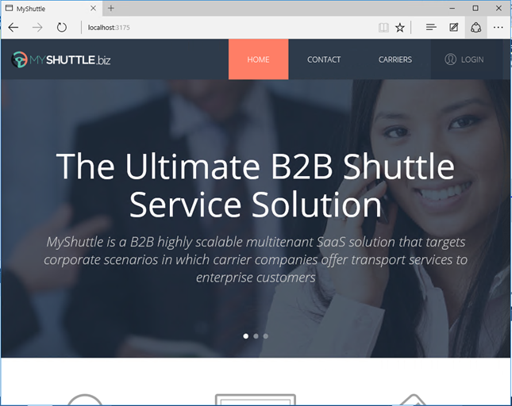

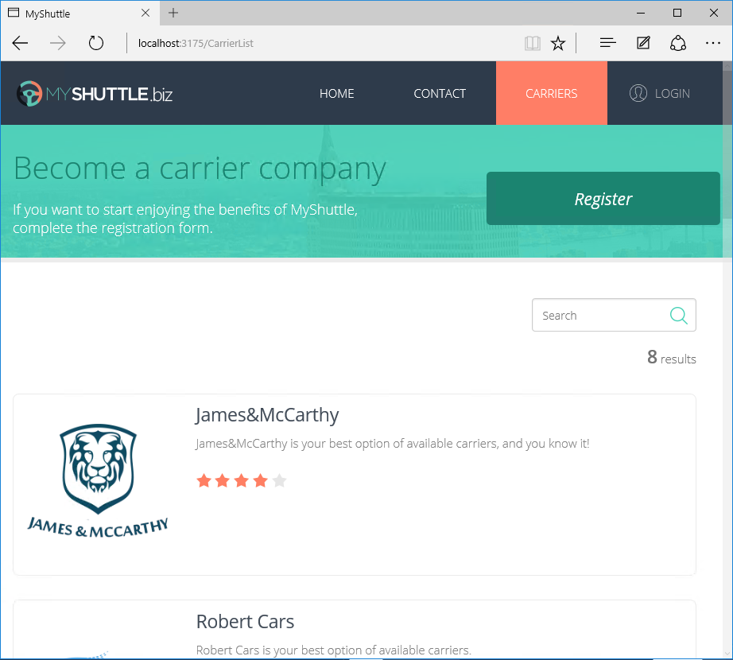

As you may notice, both mock-ups do have lot similarities on the page and their UI is very consistent. We can put the similar UI rendering and features in a Layout page. 
    
1. Re-open your **MyShuttle** application. 
        
    Or if you were unable to get it to build properly in the previous lab, go to the `.../Labs/Module 04 - Views/Begin` folder in the File Explorer. And use that code as your starting point.

2. Add a new folder to your **MyShuttle.Web / Views** folder. And name it **Shared**.  

    This folder will contain views that are commonly used. Partial views are good candidates to be organized in this folder.

3. Right-click the **Shared** folder **> Add > Existing Item**. Navigate to this lab assets location and add the **\_Layout.cshtml** file.

    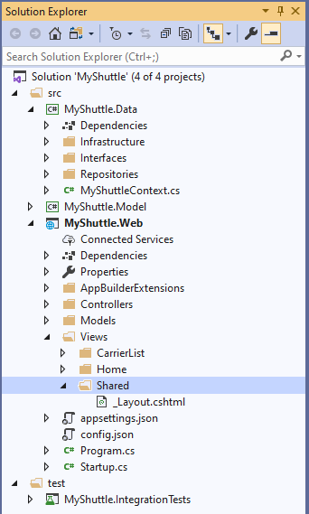

    A **Razor Layout page** is the equivalent of an ASP.NET Master Page. It defines the structure of a Web page by using **HTML markup**, and defines sections that will be filled with custom content. Web pages linked to a layout will only have to complete the sections with their own HTML. By using layout pages, your site will have a consistent layout and structure.

4. Reopen the **Views / Home / Index.cshtml** file. Specify the Layout template that we want to use for this page at the top of the **Index.cshtml** file:
```
    @{
        ViewBag.Title = "Home Page";

        Layout = "/Views/Shared/_Layout.cshtml";
    }
```


5. Review and understand the Razor and HTML markup for the layout page.

6. Run the application and you should see that the Index page has more markups now.

    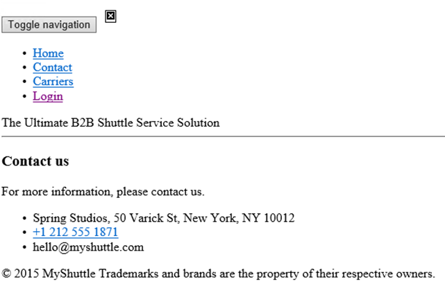

7. However, no style or image has been applied. Those references are specified in the Layout page but they are actually missing from the project. Let us fix this.
    - Navigate to **wwwroot** in the lab's assets folder `/Asset/MyShuttle/wwwroot/...`
    - Copy the static content to your own **wwwroot** folder in the Solution Explorer. Add new folders as needed.

    >    The wwwroot folder is new in ASP.NET Core. All of the static files in your project go into this folder. These are assets that the app will serve directly to clients, including HTML files, CSS files, image files, and JavaScript files.
    >
    >    The wwwroot folder is the root of your website. That is, **http://hostname/** points to **wwwroot**, all URLs for static content are relative to the wwwroot folder.
    >
    >    Code files should be placed outside of wwwroot. That includes all of your C\# files and Razor files. Having a wwwroot folder keeps a clean separation between code files and static files.

    Your solution explorer should look like this:

    

8. Before we run the application, notice that we have NOT yet configured the ability to serve static files in our pipeline. To do this, go to the **Startup.cs / Configure()** method - insert the following line after `app.ConfigureRoutes()`.

```
    app.UseStaticFiles();
```

9. Run the application. But we will see a blank page.

    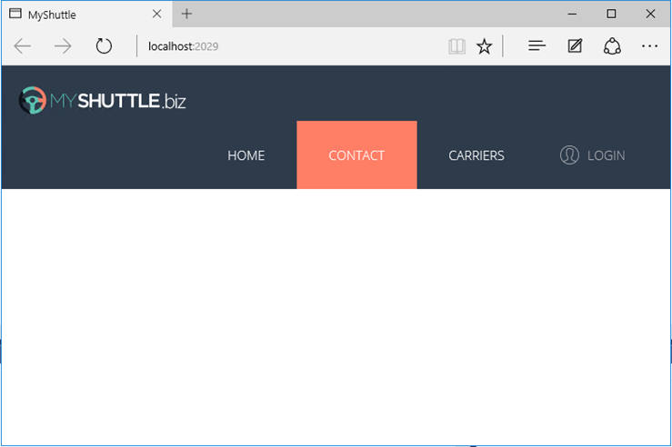

10. Resize the browser to see the "Contact us" information. 

    This is definitely not the behavior we want for our application. We will need to fix this in the next exercise.

    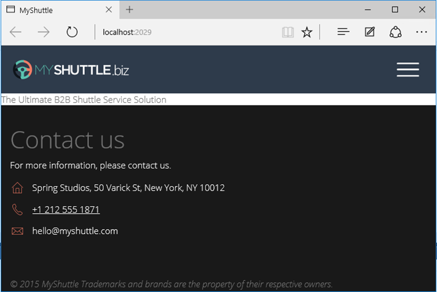


#### Task 2: Modify the index.cshtml Page

1. Take a look at the contents of the **Views / Home / Index.cshtml** file. We will be replacing this file.

2. Delete the **Index.cshtml** file.

3. Right-click the **Home** folder **> Add > Existing Item**. Navigate to this lab assets location and add the **Index.cshtml** file.

4. Spend some time to check what is implemented in the **Index.cshtml** page.  
      
    As you may have noticed, the markup is mainly decorated with styles and scripts references compared to the old Index.cshtml.

    


5. Run the application and you will notice that the default view for the Home controller looks completely different and more modern. We will discuss this in details in the Client-Side Development module.

    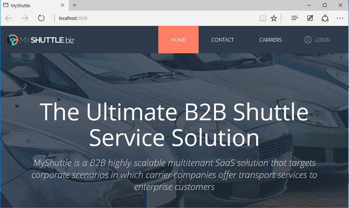


Exercise 5: Create CarrierList View
-----------------------------------

#### Objective

In this exercise, you will:

-   Create Index.cshtml view for CarrierList controller in MyShuttle
    application, which will have "register a carrier", "search carrier", and "list of all carrier" functionality.

####  Task 1: Create \_CarrierListPartial.cshtml Page

A partial view enables you to define a view that will be rendered inside a
parent view. Partial views are implemented as ASP.NET user controls (.ascx).

When a partial view is instantiated, it gets its own copy of
the [ViewDataDictionary](https://msdn.microsoft.com/en-in/library/system.web.mvc.viewdatadictionary(v=vs.100).aspx) object
that is available to the parent view. The partial view therefore has access to
the data of the parent view. However, if the partial view updates the data,
those updates affect only the partial view's ViewData object. The parent view's
data is not changed.

1. Add a new partial view to the **Shared** folder in the **MyShuttle.Web** project
    - Right-click **Shared** folder **> Add > View**
    - Name the view **_CarrierListPartial**
    - Check the box “**Create as partial view”**

    A partial view lets you define a view that will be rendered inside a parent view.

    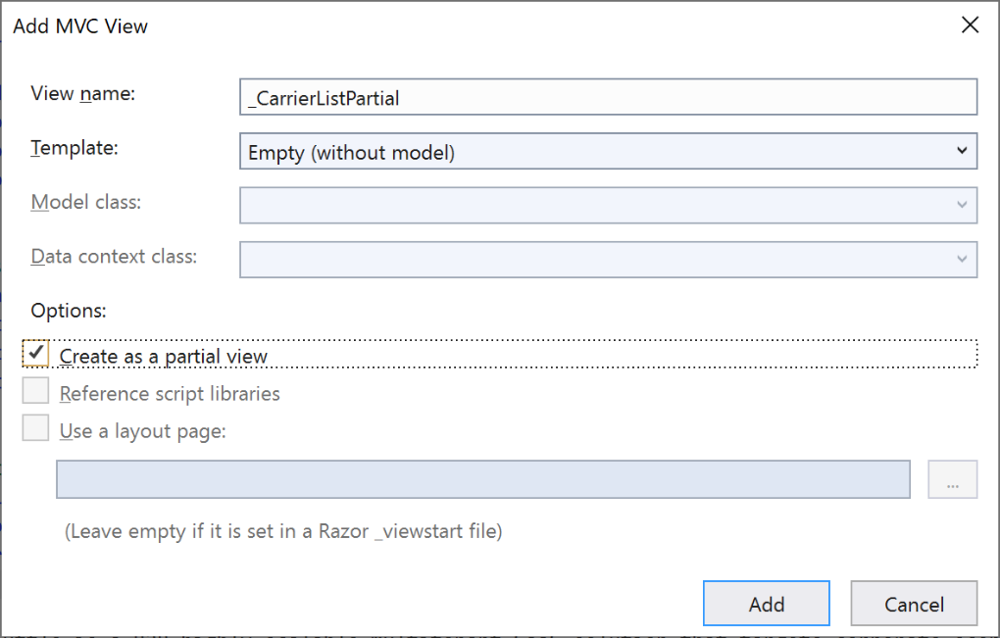

    - Click **Add**

2. We will use the **MyShuttle.Model** for the display of *List of Carriers*. Add the two lines of code from below. 

    `List<Carrier>` will be passed from the controller.

```
    @using MyShuttle.Model
    @model List<Carrier>
```

    **Do not copy html markup from this document, because copying from .docx/.pdf could cause issues with source code. Copy it from “assets” folder.**

4. We need to display how many Carriers are there in the application. 

    So let's create a div and put these count on the right-side of our page. Copy the code below in our **_CarrierListPartial.cshtml** file.

```html
    <div class="carrier-results text-right">
        <span class="n-results">@Html.Raw(@Model.Count)</span>
        <span class="text-results">results</span>
    </div>
```


    Note how we use `@Model.Count` in the code. Remember how we declared that our model was `List<Carrier>` at the top of the page.

5. Now, we need to iterate over the records in the list and display them. Copy the code below in our **_CarrierListPartial.cshtml** file.

```html
    <div class="row margin-zero carrier-info-wrapper">

        @{ var odd = true; }

        @foreach (var Tile in Model)
        {
            <article class="col-md-6 carrier-tile row margin-zero">
                <div class="carrier-info row @(odd ? "" : "even")">
                    <div class="col-xs-3 text-center img-wrapper ">
                        @{
                            var imgSrc = String.Format("data:image/png;base64,{0}",
                            Convert.ToBase64String(Tile.Picture));
                            
                        }
                    </div>

                    <div class="col-xs-9">
                        <p class="carrier-name">@Tile.Name</p>
                        <p class="carrier-description">@Tile.Description</p>
                        <div class="customer-rating" data-score="@Tile.RatingAvg"></div>
                    </div>
                </div>
            </article>

            odd = !odd;
        }

    </div>
```

    Note again how we are using the for-each loop to iterate over our `Model` (which is of type `List<Carrier>` ) in the code above.

6. This is just a partial page. 

    We can run the application AFTER we use this partial page in Index.cshtml page. Let's continue with the next task to add the functionality to register the CarrierPage

#### Task 2: Create \_RegisterCarrierForm.cshtml Page

1. Add a new partial view to the **Shared** folder in the **MyShuttle.Web** project
    - Right-click **Shared** folder **> Add > View**
    - Name the view **_RegisterCarrierForm**
    - Check the box “**Create as partial view”**

    This will be a *partial page* that will go in Index.cshtml page of CarrierList that we will write.

2. We will need to be able to pass the CarrierViewModel model from the controllers - in order to register a new carrier.

    In our **_RegisterCarrierForm.cshtml** partial view, declare the `Model` as type `CarrierViewModel` at the top. 

```
    @model MyShuttle.Web.Models.CarrierViewModel
```


3. Add the HTML mark-up code to get inputs from the user.
 `@Html.Beginform` writes an opening `<form>` tag to the response. The form
   uses the **POST** method, and the request is processed by the action method for
   the view. 

    Copy the markup code from the assets folder `...\Assets\MyShuttle\Views\Shared` into the **_RegisterCarrierForm.cshtml** partial view. 

4. When done, the file should look something like the screenshot below:

    


#### Task 3: Create \_SearchPartial.cshtml Page

1. Add a new partial view to the **Shared** folder in the **MyShuttle.Web** project
    - Right-click **Shared** folder **> Add > View**
    - Name the view **_SearchPartial**
    - Check the box “**Create as partial view”**
    
    This will be a partial page that will go in the Index.cshtml page for the CarrierList controller that we will write for searching a carrier vendor.

2. To implement the search functionality, add the markup code below to our newly created **_SearchPartial.cshtml** file. 

```html
    @model MyShuttle.Web.Models.SearchViewModel

    <div>
        @using (Html.BeginForm("CarrierListFiltered", "Index", FormMethod.Get, new { @id = "searchForm", @class = "" }))
        {
            <div class="search-input-wrapper" id="searchBtn"></div>

            @Html.TextBoxFor(m => m.SearchString, new { @id = "searchInput", @type = "search", @placeholder = "Search", @class = "form-control search-input" })
        }
    </div>
```


#### Task 4: Create Index.cshtml Page


1. Open the **Views / CarrierList / Index.cshtml** file that you created in the previous lab. Remove all its contents.

2. We will pass the *CarrierListViewModel* model from the CarrierList controller to the CarrierList view. We will also set the Layout property to *Layout.cshtml* page. 

    Add the code below to the **Views / CarrierList / Index.cshtml** file:

```html
    @model MyShuttle.Web.Models.CarrierListViewModel

    @{
        ViewBag.Title = "Home Page";
        Layout = "/Views/Shared/_Layout.cshtml";
    }

    <!-- Add the CSS references for the index.cshtml page -->

    @section styles{
        <link rel="stylesheet" type="text/css" href="Content/jquery.raty.css" xmlns="http://www.w3.org/1999/html" />
        <link rel="stylesheet" type="text/css" href="Content/form.css" xmlns="http://www.w3.org/1999/html" />
        <link rel="stylesheet" type="text/css" href="Content/carriers.css" xmlns="http://www.w3.org/1999/html" />
        <link rel="stylesheet" type="text/css" href="Content/footer.css" xmlns="http://www.w3.org/1999/html" />
    }
```


3. Next we want to display the search pane and list of all carriers that are available. These are the partial pages *_CarrierListPartial.cshtml* and *_SearchPartial.cshtml* and  that we created earlier.

    Add the code below to the **Views / CarrierList / Index.cshtml** file:
```html
    <!-- Carrier List -->
    <div>
        @await Html.PartialAsync("_RegisterCarrierForm", Model.Carrier)
    </div>

    <section class="carrier-list">
        <div class="ms-container-fluid full-spaced clearfix text-center ">
            <div class="row carrier-controls margin-zero">
                <div class="col-sm-offset-9 col-sm-3 search-carrier padding-zero">
                    @await Html.PartialAsync("_SearchPartial", Model.Search)
                </div>
            </div>
            <div id="listContainer">
                @await Html.PartialAsync("_CarrierListPartial", Model.CarrierList)
            </div>
        </div>
    </section>
```

4.  Add the scripts section at the end of the **Views / CarrierList / Index.cshtml** file:

```html
    @section scripts{
        <script charset="UTF-8" type="text/javascript" src="https://ecn.dev.virtualearth.net/mapcontrol/mapcontrol.ashx?v=7.0&s=1"></script>
        <script src="Scripts/Pages/CarrierList/index.js"></script>
    }
```


5. We are almost done with our CarrierList's Index View. Make sure we have all the scripts from our lab assets folder in our **wwwroot/scripts** folder

    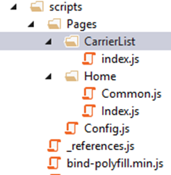

6. Let's test our application.
    - Run the application 
    - Click the **Carrier** button in the top navigation bar (*or* navigate to URL: [http://localhost:[YOUR LOCALHOST PORT]/CarrierList/Index](http://localhost:[YOUR%20LOCALHOST%20PORT]/CarrierList/Index)) to trigger the Index action method of the CarrierList controller.

        
    
    - Click *once* on the **Register** button on the page.
        
        

        You’ll see the input form that we implemented earlier in our \_RegisterCarrierForm.cshtml partial view.

        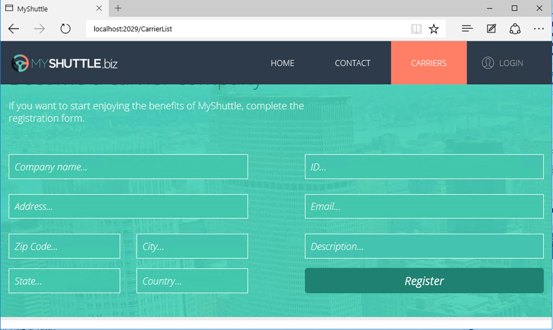
